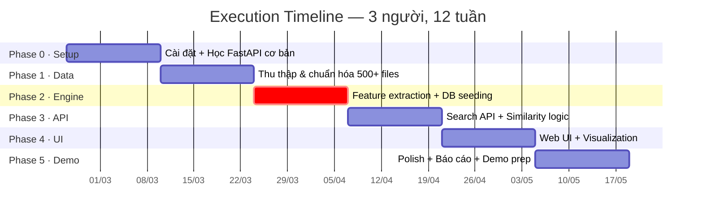

# 🎻 KẾ HOẠCH THỰC THI CHI TIẾT — PHƯƠNG ÁN B (FULL PYTHON)
## Nhóm 3 người · 12 tuần · Budget 0đ

---

# 1. PHÂN CÔNG VAI TRÒ NHÓM (3 NGƯỜI)

| Vai trò | Ký hiệu | Trách nhiệm chính | Kỹ năng cần |
|---------|---------|-------------------|-------------|
| **Tech Lead + Backend** | **TL** | Kiến trúc hệ thống, FastAPI, PostgreSQL, pgvector, deployment | Python trung bình+, SQL |
| **Audio/Data Engineer** | **AE** | Thu thập dữ liệu, feature extraction pipeline, normalization, testing chất lượng audio | Python cơ bản, chịu khó research |
| **Frontend + QA + Docs** | **FQ** | Giao diện web (HTML/CSS/JS), viết báo cáo, test thủ công, chuẩn bị demo | HTML/CSS, viết tốt |

> [!IMPORTANT]
> **Nguyên tắc vàng cho nhóm 3 người:** Không ai được làm việc cô lập quá 2 tuần. Mỗi Chủ Nhật tối có standup 15 phút (Zalo/Discord call) để sync tiến độ. Nếu 1 người stuck → 2 người còn lại pair-program hỗ trợ ngay.

---

# 2. PROJECT STRUCTURE (Tạo từ ngày đầu)

```
string-instrument-search/
├── README.md                    # Hướng dẫn setup + chạy
├── requirements.txt             # Dependencies
├── .env.example                 # Template biến môi trường
├── start.bat                    # 1-click chạy server (Windows)
│
├── app/                         # FastAPI application
│   ├── main.py                  # Entry point, CORS, mount static
│   ├── config.py                # DB URL, paths, constants
│   ├── database.py              # SQLAlchemy engine + session
│   ├── models.py                # ORM models (instruments, audio_features)
│   ├── schemas.py               # Pydantic request/response schemas
│   ├── routers/
│   │   ├── search.py            # POST /api/search
│   │   ├── instruments.py       # GET /api/instruments
│   │   └── visualize.py         # GET /api/visualize/{id}
│   └── services/
│       ├── feature_extractor.py # librosa feature extraction
│       ├── similarity.py        # pgvector query logic
│       └── visualizer.py        # matplotlib spectrogram/waveform
│
├── scripts/
│   ├── seed_database.py         # Batch: đọc data/ → extract → insert DB
│   ├── download_nsynth.py       # Download & filter NSynth dataset
│   ├── normalize_audio.py       # Convert tất cả về wav 22050Hz mono
│   └── validate_data.py         # Kiểm tra chất lượng dataset
│
├── templates/                   # Jinja2 HTML templates
│   ├── base.html
│   ├── index.html               # Trang upload + search
│   ├── results.html             # Hiển thị top-5 results
│   └── browse.html              # Duyệt database
│
├── static/                      # CSS, JS, images
│   ├── css/style.css
│   ├── js/app.js
│   └── visualizations/          # Spectrogram images (generated)
│
├── data/                        # Audio files (KHÔNG push lên Git)
│   ├── violin/
│   ├── guitar/
│   ├── cello/
│   └── ...
│
├── tests/
│   ├── test_feature_extractor.py
│   └── test_search.py
│
└── docs/
    ├── report.docx              # Báo cáo cuối kỳ
    └── slides.pptx              # Slide demo
```

---

# 3. TIMELINE CHI TIẾT — 6 PHASE



---

## PHASE 0: SETUP & ONBOARDING (Tuần 1–2) `24/02 → 09/03`

**Mục tiêu:** Cả nhóm chạy được "Hello World" FastAPI + kết nối PostgreSQL.

### Tuần 1 — Cài đặt môi trường

| Task | Ai | Chi tiết | Thời gian |
|------|----|----------|-----------|
| Cài Python 3.11 + pip + venv | Cả 3 | Mỗi người tự cài trên máy cá nhân | 1 giờ |
| Cài PostgreSQL 16 + pgvector | **TL** | Cài xong share guide cho 2 người còn lại | 2 giờ |
| Tạo Git repo + project structure | **TL** | Theo cấu trúc ở trên, push lên GitHub | 1 giờ |
| Cài VS Code + Python extension | Cả 3 | Extensions: Python, Pylance, SQLTools | 30 phút |
| Viết `requirements.txt` ban đầu | **TL** | `fastapi, uvicorn, sqlalchemy, pgvector, librosa, numpy, matplotlib, python-multipart, jinja2` | 30 phút |

### Tuần 2 — Học FastAPI cơ bản

| Task | Ai | Chi tiết | Thời gian |
|------|----|----------|-----------|
| Tutorial FastAPI (docs chính thức) | **TL**, **AE** | Tạo được endpoint GET/POST, return JSON | 4 giờ mỗi người |
| Tutorial librosa cơ bản | **AE** | Load 1 file .wav, extract MFCC, in ra | 3 giờ |
| Học HTML/CSS cơ bản + Jinja2 | **FQ** | Render template từ FastAPI, form upload | 4 giờ |
| Test pgvector: insert + query vector | **TL** | Chạy được `SELECT embedding <=> '[1,2,3]'::vector` | 2 giờ |

**✅ Checkpoint cuối Phase 0:**
- [ ] `uvicorn app.main:app --reload` chạy được trên cả 3 máy
- [ ] Endpoint `GET /health` trả về `{"status": "ok"}`
- [ ] PostgreSQL kết nối được, pgvector extension enabled
- [ ] **AE** load được 1 file .wav bằng librosa, in ra MFCC values

---

## PHASE 1: THU THẬP & CHUẨN HÓA DỮ LIỆU (Tuần 3–4) `10/03 → 23/03`

**Mục tiêu:** Có thư mục `data/` chứa 500+ files .wav đã phân loại, kèm `metadata.csv`.

### Nguồn dữ liệu (ưu tiên theo thứ tự)

| # | Nguồn | Nhạc cụ có | Số lượng ước tính | Cách lấy |
|---|-------|-----------|-------------------|----------|
| 1 | **NSynth Dataset** (Google Magenta) | Guitar, Violin, Cello, Bass, Harp | 400+ files (filter acoustic + string) | Download từ [NSynth](https://magenta.tensorflow.org/datasets/nsynth), filter JSON metadata |
| 2 | **IRMAS Dataset** | Guitar, Violin, Cello | 100+ files | Download từ [IRMAS](https://www.upf.edu/web/mtg/irmas) |
| 3 | **Freesound.org** | Đàn tranh, Đàn bầu, Banjo, Ukulele, Mandolin | 50+ files bổ sung | Search thủ công, chọn file CC license |
| 4 | **Philharmonia Orchestra** | Violin, Viola, Cello, Double Bass, Harp | 200+ files (single notes) | Download từ [philharmonia.co.uk/explore/sound_samples](https://philharmonia.co.uk/explore/sound_samples) |

### Nhạc cụ bộ dây mục tiêu (tối thiểu 5 loại)

| Nhạc cụ | Phân loại | Target files |
|---------|-----------|-------------|
| 🎻 Violin | Bowed string | 100+ |
| 🎻 Viola | Bowed string | 50+ |
| 🎻 Cello | Bowed string | 100+ |
| 🎸 Acoustic Guitar | Plucked string | 100+ |
| 🪕 Bass (Double Bass / Electric Bass) | Bowed/Plucked | 80+ |
| 🎵 Harp | Plucked string | 50+ |
| 🪕 Banjo / Ukulele / Others | Plucked string | 20+ (bonus) |

### Phân công Phase 1

| Task | Ai | Chi tiết | Deadline |
|------|----|----------|----------|
| Download + filter NSynth | **AE** | Viết `scripts/download_nsynth.py`: download, parse JSON metadata, filter `instrument_family="string"` + `instrument_source="acoustic"`, copy files | Cuối tuần 3 |
| Download IRMAS + Philharmonia | **FQ** | Download thủ công, phân loại vào thư mục đúng | Cuối tuần 3 |
| Bổ sung từ Freesound | **FQ** | Search + download, đảm bảo license CC | Tuần 4 |
| Viết script chuẩn hóa audio | **AE** | `scripts/normalize_audio.py`: convert tất cả → `.wav`, 22050Hz, mono, trim silence | Tuần 4 |
| Tạo `metadata.csv` | **AE** + **FQ** | Columns: `file_path, instrument_name, note, duration_sec, sample_rate, source` | Cuối tuần 4 |
| Validate dataset | **TL** | `scripts/validate_data.py`: đếm files, check duration > 1s, check không corrupt | Cuối tuần 4 |

**Script chuẩn hóa mẫu:**
```python
# scripts/normalize_audio.py
import librosa
import soundfile as sf
import os
from pathlib import Path

def normalize_audio(input_dir: str, output_dir: str, target_sr: int = 22050):
    """Convert tất cả audio files sang wav, 22050Hz, mono."""
    for root, dirs, files in os.walk(input_dir):
        for f in files:
            if f.endswith(('.wav', '.mp3', '.flac', '.ogg', '.aiff')):
                input_path = os.path.join(root, f)
                # Giữ nguyên cấu trúc thư mục
                rel_path = os.path.relpath(root, input_dir)
                out_dir = os.path.join(output_dir, rel_path)
                os.makedirs(out_dir, exist_ok=True)
                
                out_path = os.path.join(out_dir, Path(f).stem + '.wav')
                
                try:
                    y, sr = librosa.load(input_path, sr=target_sr, mono=True)
                    # Trim silence đầu/cuối
                    y_trimmed, _ = librosa.effects.trim(y, top_db=20)
                    sf.write(out_path, y_trimmed, target_sr)
                    print(f"✓ {input_path} → {out_path} ({len(y_trimmed)/target_sr:.1f}s)")
                except Exception as e:
                    print(f"✗ SKIP {input_path}: {e}")
```

**✅ Checkpoint cuối Phase 1:**
- [ ] Thư mục `data/` có 500+ files `.wav`
- [ ] Mỗi nhạc cụ có ít nhất 50 files
- [ ] `metadata.csv` đầy đủ, không có dòng lỗi
- [ ] Tất cả files: mono, 22050Hz, duration 1-10 giây

---

## PHASE 2: CORE ENGINE — Feature Extraction + DB (Tuần 5–6) `24/03 → 06/04`

> [!CAUTION]
> **🔴 CRITICAL PATH — Phase quan trọng nhất cả dự án.** Nếu feature extraction sai → similarity search vô nghĩa → bảo vệ fail. Phải test kỹ.

### Phân công Phase 2

| Task | Ai | Chi tiết | Deadline |
|------|----|----------|----------|
| Implement `feature_extractor.py` | **AE** + **TL** (pair) | Hàm `extract_features(file_path) → np.ndarray[30]`. **Pair programming bắt buộc cho task này.** | Giữa tuần 5 |
| Unit tests cho feature extractor | **AE** | Test với 5-10 files: verify output shape = (30,), giá trị trong range hợp lý | Cuối tuần 5 |
| Tạo DB schema (migration script) | **TL** | DDL script tạo tables + pgvector index | Tuần 5 |
| ORM models (SQLAlchemy) | **TL** | `models.py`: `Instrument`, `AudioFeature` classes | Tuần 5 |
| Batch seeding script | **TL** + **AE** | `scripts/seed_database.py`: đọc 500 files → extract features → normalize → insert | Tuần 6 |
| Sanity check | Cả 3 | Query: upload guitar → top-5 phải chủ yếu guitar. Nếu không → debug | Cuối tuần 6 |
| Nghiên cứu UI mockup | **FQ** | Vẽ wireframe trên giấy / Figma cho trang Search + Results | Song song tuần 5-6 |

### Feature Extraction — Code đầy đủ

```python
# app/services/feature_extractor.py
import librosa
import numpy as np
from typing import Dict, Any

def extract_features(file_path: str, sr: int = 22050) -> Dict[str, Any]:
    """
    Trích xuất đặc trưng âm thanh từ file.
    Returns dict chứa:
      - feature_vector: np.ndarray shape (30,) — dùng cho similarity search
      - details: dict các giá trị riêng lẻ — dùng cho hiển thị/debug
      - metadata: dict thông tin file (duration, sr)
    """
    y, sr = librosa.load(file_path, sr=sr, mono=True)
    
    # === 1. MFCC (13 dims) — "Fingerprint" âm thanh ===
    mfcc = librosa.feature.mfcc(y=y, sr=sr, n_mfcc=13)
    mfcc_mean = np.mean(mfcc, axis=1)      # (13,)
    
    # === 2. Chroma (12 dims) — Pitch / nốt nhạc ===
    chroma = librosa.feature.chroma_stft(y=y, sr=sr)
    chroma_mean = np.mean(chroma, axis=1)   # (12,)
    
    # === 3. Spectral Features (5 dims) — Texture âm thanh ===
    centroid = float(np.mean(librosa.feature.spectral_centroid(y=y, sr=sr)))
    bandwidth = float(np.mean(librosa.feature.spectral_bandwidth(y=y, sr=sr)))
    rolloff = float(np.mean(librosa.feature.spectral_rolloff(y=y, sr=sr)))
    zcr = float(np.mean(librosa.feature.zero_crossing_rate(y)))
    rms = float(np.mean(librosa.feature.rms(y=y)))
    
    # === Concatenate → vector 30 chiều ===
    feature_vector = np.concatenate([
        mfcc_mean,                              # 13
        chroma_mean,                            # 12
        [centroid, bandwidth, rolloff, zcr, rms] # 5
    ])
    
    return {
        "feature_vector": feature_vector,       # shape (30,)
        "details": {
            "mfcc_mean": mfcc_mean.tolist(),
            "chroma_mean": chroma_mean.tolist(),
            "spectral_centroid": centroid,
            "spectral_bandwidth": bandwidth,
            "spectral_rolloff": rolloff,
            "zero_crossing_rate": zcr,
            "rms_energy": rms,
        },
        "metadata": {
            "duration_sec": float(len(y) / sr),
            "sample_rate": sr,
        }
    }
```

### Normalization Strategy (QUAN TRỌNG)

```python
# scripts/seed_database.py (phần normalization)
import numpy as np
from sklearn.preprocessing import StandardScaler

def seed_database(data_dir: str, db_session):
    """Batch extract + normalize + insert."""
    # Bước 1: Extract features cho TẤT CẢ files
    all_vectors = []
    all_records = []
    for file_path, instrument_name in iterate_dataset(data_dir):
        result = extract_features(file_path)
        all_vectors.append(result["feature_vector"])
        all_records.append((file_path, instrument_name, result))
    
    # Bước 2: Fit scaler trên toàn dataset
    vectors_matrix = np.array(all_vectors)  # shape (N, 30)
    scaler = StandardScaler()
    normalized_vectors = scaler.fit_transform(vectors_matrix)
    
    # ⚠️ LƯU scaler để dùng khi search (file query cũng phải normalize cùng scaler)
    import joblib
    joblib.dump(scaler, "models/scaler.pkl")
    
    # Bước 3: Insert vào database
    for i, (file_path, instrument_name, result) in enumerate(all_records):
        norm_vector = normalized_vectors[i].tolist()
        insert_to_db(db_session, file_path, instrument_name, result, norm_vector)
    
    print(f"✅ Seeded {len(all_records)} records. Scaler saved to models/scaler.pkl")
```

> [!WARNING]
> **Sai lầm phổ biến:** Quên normalize vector query khi search. File upload từ user PHẢI được transform bằng **cùng scaler** đã fit trên dataset. Nếu không, khoảng cách cosine sẽ vô nghĩa.

### Sanity Check Script

```python
# scripts/sanity_check.py
"""Chạy sau khi seed → kiểm tra kết quả có hợp lý không."""

def sanity_check(db_session):
    # Lấy 1 file guitar bất kỳ trong DB
    guitar_sample = query_one_by_instrument(db_session, "guitar")
    
    # Search top-10
    results = search_similar(db_session, guitar_sample.embedding, limit=10)
    
    # Đếm bao nhiêu kết quả cũng là guitar
    guitar_count = sum(1 for r in results if r.instrument_name == "guitar")
    
    print(f"Query: guitar → Top-10 results: {guitar_count}/10 là guitar")
    
    if guitar_count >= 6:
        print("✅ PASS — Features đang hoạt động hợp lý")
    else:
        print("❌ FAIL — Cần debug feature extraction hoặc normalization")
        # In chi tiết để debug
        for r in results:
            print(f"  {r.instrument_name}: distance={r.distance:.4f}")
```

**✅ Checkpoint cuối Phase 2:**
- [ ] `extract_features()` chạy đúng, output shape (30,)
- [ ] DB có 500+ records, vector embedding normalized
- [ ] `scaler.pkl` đã được save
- [ ] Sanity check PASS: query guitar → ≥6/10 top results là guitar
- [ ] Sanity check PASS: query violin → ≥6/10 top results là violin

---

## PHASE 3: SEARCH API (Tuần 7–8) `07/04 → 20/04`

### Phân công Phase 3

| Task | Ai | Chi tiết | Deadline |
|------|----|----------|----------|
| `POST /api/search` endpoint | **TL** | Upload file → extract → normalize → query pgvector → return top-5 | Tuần 7 |
| `GET /api/instruments` endpoint | **TL** | List all instruments, with count per type | Tuần 7 |
| `GET /api/instruments/{id}` | **TL** | Detail view: metadata + features + audio URL | Tuần 7 |
| Visualization service | **AE** | `visualizer.py`: generate waveform, spectrogram, chromagram images (matplotlib) | Tuần 7-8 |
| `GET /api/visualize/{id}` | **AE** + **TL** | Serve generated visualization images | Tuần 8 |
| API testing (manual + Swagger) | **FQ** | Test tất cả endpoints qua Swagger UI, ghi bug | Tuần 8 |
| Bắt đầu code HTML templates | **FQ** | `base.html`, `index.html` (form upload) | Song song tuần 7-8 |

### Search API — Code

```python
# app/routers/search.py
from fastapi import APIRouter, UploadFile, File, Depends
from sqlalchemy.orm import Session
import tempfile, os, joblib
import numpy as np

router = APIRouter(prefix="/api", tags=["Search"])

@router.post("/search")
async def search_similar_instruments(
    file: UploadFile = File(...),
    limit: int = 5,
    db: Session = Depends(get_db)
):
    # 1. Save uploaded file temporarily
    with tempfile.NamedTemporaryFile(delete=False, suffix=".wav") as tmp:
        content = await file.read()
        tmp.write(content)
        tmp_path = tmp.name
    
    try:
        # 2. Extract features
        result = extract_features(tmp_path)
        query_vector = result["feature_vector"]
        
        # 3. Normalize bằng CÙNG scaler đã fit trên dataset
        scaler = joblib.load("models/scaler.pkl")
        query_normalized = scaler.transform(query_vector.reshape(1, -1))[0]
        
        # 4. Generate visualizations cho file query
        viz_paths = generate_visualizations(tmp_path, file.filename)
        
        # 5. Query pgvector — cosine distance
        vector_str = str(query_normalized.tolist())
        top_results = db.execute(text(f"""
            SELECT i.*, af.embedding <=> '{vector_str}' AS distance
            FROM audio_features af
            JOIN instruments i ON af.instrument_id = i.id
            ORDER BY distance ASC
            LIMIT :limit
        """), {"limit": limit}).fetchall()
        
        # 6. Format response
        return {
            "query": {
                "filename": file.filename,
                "features": result["details"],
                "visualizations": viz_paths,
            },
            "results": [
                {
                    "rank": idx + 1,
                    "instrument_name": row.instrument_name,
                    "file_name": row.file_name,
                    "similarity_percent": round((1 - row.distance / 2) * 100, 2),
                    "distance": round(row.distance, 6),
                    "audio_url": f"/static/audio/{row.file_path}",
                }
                for idx, row in enumerate(top_results)
            ]
        }
    finally:
        os.unlink(tmp_path)
```

### Visualization Service — Code

```python
# app/services/visualizer.py
import librosa
import librosa.display
import matplotlib
matplotlib.use('Agg')  # Non-interactive backend
import matplotlib.pyplot as plt
import numpy as np
import os, uuid

VIZ_DIR = "static/visualizations"

def generate_visualizations(file_path: str, filename: str) -> dict:
    """Generate waveform, spectrogram, chromagram → save as PNG."""
    y, sr = librosa.load(file_path, sr=22050)
    viz_id = uuid.uuid4().hex[:8]
    os.makedirs(VIZ_DIR, exist_ok=True)
    paths = {}
    
    # 1. Waveform
    fig, ax = plt.subplots(figsize=(10, 3))
    librosa.display.waveshow(y, sr=sr, ax=ax, color='#2ECC71')
    ax.set_title(f'Waveform — {filename}', fontsize=12)
    ax.set_xlabel('Time (s)')
    ax.set_ylabel('Amplitude')
    path = f"{VIZ_DIR}/waveform_{viz_id}.png"
    fig.savefig(path, bbox_inches='tight', dpi=100)
    plt.close(fig)
    paths["waveform"] = f"/{path}"
    
    # 2. Mel Spectrogram
    fig, ax = plt.subplots(figsize=(10, 4))
    S = librosa.feature.melspectrogram(y=y, sr=sr, n_mels=128)
    S_dB = librosa.power_to_db(S, ref=np.max)
    img = librosa.display.specshow(S_dB, sr=sr, x_axis='time', y_axis='mel', ax=ax, cmap='magma')
    fig.colorbar(img, ax=ax, format='%+2.0f dB')
    ax.set_title(f'Mel Spectrogram — {filename}', fontsize=12)
    path = f"{VIZ_DIR}/spectrogram_{viz_id}.png"
    fig.savefig(path, bbox_inches='tight', dpi=100)
    plt.close(fig)
    paths["spectrogram"] = f"/{path}"
    
    # 3. Chromagram
    fig, ax = plt.subplots(figsize=(10, 3))
    chroma = librosa.feature.chroma_stft(y=y, sr=sr)
    img = librosa.display.specshow(chroma, sr=sr, x_axis='time', y_axis='chroma', ax=ax, cmap='coolwarm')
    fig.colorbar(img, ax=ax)
    ax.set_title(f'Chromagram — {filename}', fontsize=12)
    path = f"{VIZ_DIR}/chromagram_{viz_id}.png"
    fig.savefig(path, bbox_inches='tight', dpi=100)
    plt.close(fig)
    paths["chromagram"] = f"/{path}"
    
    return paths
```

**✅ Checkpoint cuối Phase 3:**
- [ ] Swagger UI hoạt động tại `http://localhost:8000/docs`
- [ ] Upload file .wav → nhận được JSON với top-5 results + similarity scores
- [ ] Visualization images được generate và serve đúng
- [ ] Error handling: file format sai → trả lỗi 400, không crash server

---

## PHASE 4: WEB UI + KẾT QUẢ TRUNG GIAN (Tuần 9–10) `21/04 → 04/05`

### Phân công Phase 4

| Task | Ai | Chi tiết | Deadline |
|------|----|----------|----------|
| Trang Search (index.html) | **FQ** | Form upload, drag-and-drop, nút search, loading spinner | Tuần 9 |
| Trang Results (results.html) | **FQ** + **TL** | Top-5 cards, audio players, similarity bars, visualizations | Tuần 9-10 |
| Trang Browse (browse.html) | **FQ** | Danh sách 500 files, filter theo nhạc cụ, pagination | Tuần 10 |
| Intermediate results panel | **AE** | Hiển thị: feature vector values, spectrogram comparison (query vs results) | Tuần 10 |
| CSS styling | **FQ** | Dark theme, responsive, đẹp cho demo | Song song |
| Integration testing | Cả 3 | End-to-end: upload → results → play audio → check intermediate | Cuối tuần 10 |

### UI Mockup — Trang kết quả

```
┌─────────────────────────────────────────────────────────────┐
│  🎻 String Instrument Sound Search                    [Browse DB] │
├─────────────────────────────────────────────────────────────┤
│                                                             │
│  ┌──── Your Query ────────────────────────────────────┐    │
│  │ 📎 uploaded_guitar.wav        ▶ [Play]             │    │
│  │ ┌─Waveform──────┐ ┌─Spectrogram────┐ ┌─Chroma──┐ │    │
│  │ │ ~~~~~~~~~~~~~ │ │ ▓▓▓▒▒░░░░░░░░░ │ │ ■□■□■■ │ │    │
│  │ └───────────────┘ └────────────────┘ └────────┘  │    │
│  │ Features: MFCC=[..] Centroid=2341Hz ZCR=0.08     │    │
│  └──────────────────────────────────────────────────┘    │
│                                                             │
│  ━━━ Top 5 Results ━━━━━━━━━━━━━━━━━━━━━━━━━━━━━━━━━━━━━  │
│                                                             │
│  #1  🎸 Guitar — note_C4.wav       Similarity: ████████ 94.2% │
│      ▶ [Play]  [View Features]  [Compare Spectrogram]        │
│                                                             │
│  #2  🎸 Guitar — note_D4.wav       Similarity: ███████░ 89.1% │
│      ▶ [Play]  [View Features]  [Compare Spectrogram]        │
│                                                             │
│  #3  🎸 Guitar — note_E4.wav       Similarity: ██████░░ 82.7% │
│      ▶ [Play]  [View Features]  [Compare Spectrogram]        │
│                                                             │
│  #4  🪕 Banjo — note_C4.wav        Similarity: █████░░░ 71.3% │
│      ▶ [Play]  [View Features]  [Compare Spectrogram]        │
│                                                             │
│  #5  🎻 Violin — note_C4.wav       Similarity: ████░░░░ 65.8% │
│      ▶ [Play]  [View Features]  [Compare Spectrogram]        │
│                                                             │
│  ━━━ Intermediate Processing Steps ━━━━━━━━━━━━━━━━━━━━━━━  │
│  Step 1: Audio loaded (22050Hz, mono, 3.2s)                  │
│  Step 2: Extracted 30-dim feature vector                     │
│  Step 3: Normalized using StandardScaler                     │
│  Step 4: Cosine similarity search in pgvector (500 vectors)  │
│  Step 5: Returned top-5 results sorted by similarity          │
│  Processing time: 1.23 seconds                               │
└─────────────────────────────────────────────────────────────┘
```

**✅ Checkpoint cuối Phase 4:**
- [ ] Trang web hoạt động end-to-end trên browser
- [ ] Audio player play được cả file query lẫn result files
- [ ] Visualizations hiển thị đúng (waveform, spectrogram, chromagram)
- [ ] Intermediate results hiển thị rõ ràng các bước xử lý
- [ ] Responsive trên laptop screen (không cần mobile)

---

## PHASE 5: POLISH & DEMO PREP (Tuần 11–12) `05/05 → 18/05`

### Phân công Phase 5

| Task | Ai | Chi tiết | Deadline |
|------|----|----------|----------|
| Bug fixing (critical) | **TL** + **AE** | Fix tất cả bugs phát hiện từ Phase 4 | Tuần 11 |
| Chuẩn bị test files | **AE** | 5-10 files test: 3 trong dataset (khác file gốc), 3-5 ngoài dataset (nhạc cụ mới/chưa có) | Tuần 11 |
| Viết kịch bản demo | **FQ** | Script step-by-step: mở app → upload → giải thích features → chỉ kết quả | Tuần 11 |
| Viết báo cáo | **FQ** + **AE** | Sơ đồ khối, giải thích features, kết quả evaluation | Tuần 11-12 |
| Làm slide trình bày | **FQ** | 10-15 slides: giới thiệu, kiến trúc, features, demo, kết luận | Tuần 12 |
| Dry-run demo | Cả 3 | Chạy thử 3 lần, đo thời gian, sửa script nếu cần | Tuần 12 |
| Quay video backup | **TL** | Screen recording toàn bộ flow demo, 3-5 phút | Cuối tuần 12 |
| Final `README.md` | **TL** | Hướng dẫn setup từ 0: install deps → init DB → seed data → run server | Cuối tuần 12 |

### Demo Script gợi ý (5 phút)

```
1. [30s] Giới thiệu: "Hệ thống tìm kiếm nhạc cụ bộ dây dựa trên đặc trưng âm thanh"
2. [30s] Mở trang Browse: "Hệ thống hiện có 500+ files, 6 loại nhạc cụ"
3. [60s] Upload file guitar → chỉ intermediate results: "Hệ thống extract 30 đặc trưng"
4. [60s] Chỉ top-5 results: "4/5 là guitar — chứng tỏ features hoạt động đúng"
5. [30s] Play audio so sánh: query vs result #1
6. [30s] So sánh spectrogram: query vs result #1
7. [60s] Upload file NGOÀI dataset (nhạc cụ chưa có - ví dụ đàn tranh):
         "Hệ thống vẫn tìm được files có timbre gần nhất"
8. [30s] Giải thích kỹ thuật: cosine similarity + pgvector
9. [30s] Kết luận + Q&A
```

**✅ Checkpoint cuối Phase 5:**
- [ ] Demo chạy mượt < 5 giây/query
- [ ] Báo cáo + slide hoàn chỉnh
- [ ] Video backup đã quay
- [ ] `README.md` hướng dẫn setup hoàn chỉnh
- [ ] Dry-run PASS 3/3 lần

---

# 4. ĐỀ XUẤT NÂNG CAO: Audio Embeddings bằng Neural Network 🧠

> [!NOTE]
> **Đây là hướng nâng cao.** Chỉ làm nếu nhóm hoàn thành MVP sớm (trước tuần 10). Không ảnh hưởng điểm nếu không làm, nhưng sẽ gây ấn tượng mạnh nếu demo được.

### Ý tưởng

Thay vì dùng hand-crafted features (MFCC, Chroma...), sử dụng **pre-trained neural network** để tạo embedding tự động:

| Approach | MVP (Đang làm) | Nâng cao |
|----------|----------------|----------|
| Feature extraction | Thủ công: MFCC + Chroma + Spectral → 30-dim | Model pre-trained: audio → 128/512-dim embedding tự động |
| Thư viện | `librosa` | `openl3`, `panns-inference`, hoặc `CLAP` |
| Ưu điểm | Dễ hiểu, giải thích được từng feature | Chất lượng similarity cao hơn, bắt được patterns phức tạp |
| Nhược điểm | Bỏ sót thông tin mà hand-craft không capture | "Black box", khó giải thích cho giảng viên |

### Công cụ gợi ý

- **OpenL3** (`openl3` pip package) — Facebook Research, tạo audio embedding 512-dim, cực dễ dùng:
  ```python
  import openl3
  import soundfile as sf
  audio, sr = sf.read("guitar.wav")
  embedding, ts = openl3.get_audio_embedding(audio, sr, content_type="music")
  # embedding shape: (N_frames, 512) → lấy mean → (512,)
  ```
- **PANNs** (Pretrained Audio Neural Networks) — Google, classify 527 audio events
- **CLAP** (Contrastive Language-Audio Pretraining) — Microsoft, search audio bằng text query

### Cách tích hợp (nếu làm)

Thêm 1 cột `embedding_nn vector(512)` vào bảng `audio_features`, chạy song song với `embedding` 30-dim hiện tại. UI cho phép chọn "Search by: [Traditional Features] [Neural Embedding]" → so sánh kết quả.

**Điều này tạo câu chuyện rất hay cho bảo vệ:** *"Chúng em đã implement cả 2 approach — traditional feature engineering VÀ neural embedding — và so sánh chất lượng. Neural embedding cho kết quả tốt hơn X% nhưng khó giải thích hơn."*

---

# 5. COMMUNICATION & WORKFLOW

### Weekly Standup (mỗi Chủ Nhật tối, 15 phút)

```
Mỗi người trả lời 3 câu:
1. Tuần này làm được gì?
2. Tuần sau sẽ làm gì?
3. Đang stuck ở đâu? (nếu có)
```

### Tools

| Mục đích | Tool | Lý do |
|----------|------|-------|
| Quản lý task | Trello / Notion (free) | Kanban board, mỗi task có assignee + deadline |
| Code | GitHub (free) | Version control, pull requests |
| Chat nhóm | Zalo / Discord | Realtime communication |
| Demo video | OBS Studio (free) | Quay video backup |

### Git Workflow (đơn giản)

```
main ← Chỉ merge code đã test
  ↑
  feature/xxx ← Mỗi người code trên branch riêng
```

Không cần PR review formal — merge khi đã chạy được local, conflict thì giải quyết qua call.

---

# 6. TỔNG KẾT PHÂN CÔNG THEO TUẦN

| Tuần | TL (Tech Lead) | AE (Audio Engineer) | FQ (Frontend + QA) |
|------|----------------|--------------------|--------------------|
| 1 | Setup repo, PostgreSQL, pgvector | Cài Python, tutorial librosa | Cài môi trường |
| 2 | Tutorial FastAPI, test pgvector | Tutorial librosa + extract MFCC | Tutorial Jinja2 + HTML form |
| 3 | — | Download + filter NSynth | Download IRMAS + Freesound |
| 4 | Validate data script | Normalize audio script + metadata.csv | Bổ sung data từ Freesound |
| 5 | DB schema + ORM models | **Feature extractor (pair với TL)** | Wireframe UI mockup |
| 6 | **Seed script (pair với AE)** | Unit test features + sanity check | Wireframe + bắt đầu HTML |
| 7 | Search API endpoints | Visualization service | Test API qua Swagger + HTML template |
| 8 | API error handling + polish | Visualize endpoint + test | Trang Upload hoàn chỉnh |
| 9 | Integration: API ↔ UI | Intermediate results panel | Trang Results + CSS styling |
| 10 | Integration testing | Compare spectrogram feature | Trang Browse + final CSS |
| 11 | Bug fixing | Chuẩn bị test files + evaluation | Báo cáo + slide |
| 12 | README + video backup + dry-run | Dry-run + hỗ trợ báo cáo | Demo script + dry-run |
