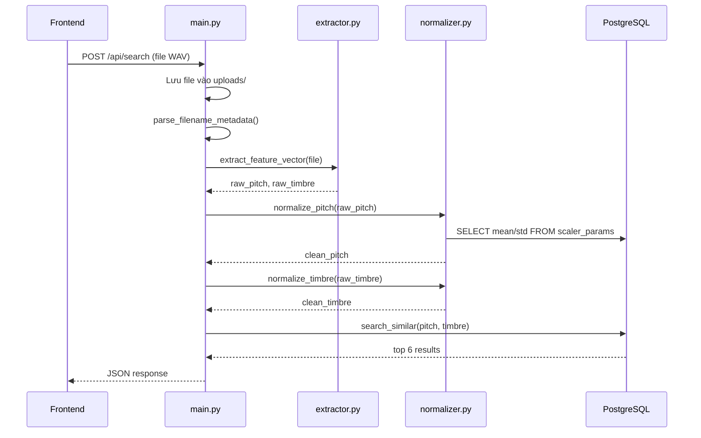

# Giải thích chi tiết `backend/main.py`

File này là **entry point** của API server — nơi nhận request từ frontend, xử lý, và trả kết quả.

---

## Phần 1: Import & Setup (dòng 1–18)

```python
import os                    # Thao tác với đường dẫn file/thư mục
import shutil                # Copy file (dùng để lưu file upload)
import time                  # Đo thời gian xử lý
import urllib.parse          # Mã hóa URL (xử lý ký tự đặc biệt như #, khoảng trắng)
```

```python
from fastapi import FastAPI, UploadFile, File, Form
```
- `FastAPI`: Framework web — tự tạo API docs, validate input
- `UploadFile`: Kiểu dữ liệu cho file upload
- `File(...)`: Đánh dấu tham số là file bắt buộc

```python
from fastapi.staticfiles import StaticFiles   # Phục vụ file tĩnh (HTML, CSS, WAV)
from fastapi.responses import JSONResponse     # Trả JSON response tùy chỉnh
```

```python
import sys
sys.path.insert(0, os.path.dirname(os.path.dirname(os.path.abspath(__file__))))
```
> Thêm thư mục gốc project vào `sys.path` để Python tìm được module `backend.*` khi chạy bằng uvicorn.

```python
from backend.config import UPLOAD_DIR, BASE_DIR, PITCH_DIM, TIMBRE_DIM
from backend.features.extractor import extract_feature_vector
from backend.search.normalizer import normalize_pitch, normalize_timbre
from backend.search.similarity import search_similar
```
Import 4 module nội bộ:
- `config`: Hằng số cấu hình (đường dẫn, kích thước vector)
- `extractor`: Trích xuất đặc trưng âm thanh từ file WAV
- `normalizer`: Chuẩn hóa vector (Z-Score, L2)
- `similarity`: Tìm kiếm tương tự trong DB

```python
app = FastAPI(title="Violin & String Instrument Finder")
```
> Khởi tạo ứng dụng FastAPI. `title` hiển thị trên trang docs (`/docs`).

---

## Phần 2: Hàm `parse_filename_metadata` (dòng 20–56)

**Mục đích**: Trích xuất metadata (nhạc cụ, kỹ thuật, nốt, dynamics) từ tên file.

```python
def parse_filename_metadata(filename: str):
    parts = filename.replace(".wav", "").split("_")
```
> Bỏ đuôi `.wav`, tách tên file theo `_`.
> Ví dụ: `viola_ord_A#3_ff_851.wav` → `["viola", "ord", "A#3", "ff", "851"]`

```python
    meta = {
        "instrument": "Unknown",
        "technique": "Unknown",
        "pitch": "Unknown",
        "dynamics": "Unknown",
        "string_id": "Unknown"
    }
```
> Giá trị mặc định nếu không parse được.

```python
    if len(parts) >= 4:
        meta["instrument"] = parts[0].capitalize()    # "viola" → "Viola"
        meta["technique"] = "ordinario" if parts[1] == "ord" else parts[1]  # "ord" → "ordinario"
        meta["pitch"] = parts[2]                      # "A#3"
        meta["dynamics"] = parts[3]                    # "ff"
```
> Parse theo format TinySOL: `{instrument}_{technique}_{pitch}_{dynamics}_{id}`

```python
    try:
        from backend.database import get_connection
        conn = get_connection()
        with conn.cursor() as cur:
            cur.execute(
                "SELECT instrument, technique, pitch, dynamics, string_id "
                "FROM audio_files WHERE file_name = %s LIMIT 1",
                (filename,)
            )
            row = cur.fetchone()
            if row:
                meta["instrument"] = row[0] if row[0] else meta["instrument"]
                meta["technique"]  = row[1] if row[1] else meta["technique"]
                meta["pitch"]      = row[2] if row[2] else meta["pitch"]
                meta["dynamics"]   = row[3] if row[3] else meta["dynamics"]
                if row[4] is not None:
                    meta["string_id"] = int(row[4])
        conn.close()
    except Exception as e:
        pass    # Nếu DB lỗi, vẫn trả metadata đã parse từ tên file
```
> **Cố gắng lấy metadata chính xác từ DB** (nếu file này đã được index).
> Nếu tìm thấy → ghi đè lên giá trị đã parse từ tên file.
> Nếu DB lỗi → bỏ qua, dùng metadata đã parse.

---

## Phần 3: API Endpoint `/api/search` (dòng 58–112)

```python
@app.post("/api/search")
async def search_audio(file: UploadFile = File(...)):
```
> Định nghĩa API POST tại `/api/search`.
> Nhận 1 tham số: `file` — file âm thanh upload bắt buộc (`File(...)`).

```python
    start_api = time.perf_counter()
```
> Bắt đầu đo thời gian xử lý toàn bộ request.

### Bước 1: Lưu file tạm (dòng 63–66)
```python
    file_path = os.path.join(UPLOAD_DIR, file.filename)
    with open(file_path, "wb") as buffer:
        shutil.copyfileobj(file.file, buffer)
```
> Lưu file upload vào thư mục `uploads/` để các bước sau đọc từ disk.

### Bước 1.5: Parse metadata (dòng 68–69)
```python
    input_meta = parse_filename_metadata(file.filename)
```
> Lấy metadata của file input để hiển thị cho người dùng (nhạc cụ gì, nốt gì, ...).

### Bước 2: Trích xuất vector thô (dòng 71–75)
```python
    raw_pitch, raw_timbre, rms_mean, actual_sec = extract_feature_vector(file_path)
```
> Gọi `extractor.py` để trích xuất:
> - `raw_pitch`: Vector cao độ thô (1D — MIDI F0)
> - `raw_timbre`: Vector âm sắc thô (18D — MFCC + Spectral Contrast)
> - `rms_mean`: Năng lượng trung bình (RMS)
> - `actual_sec`: Thời gian xử lý trích xuất

> Nếu lỗi → trả HTTP 400 với thông báo lỗi.

### Bước 3: Chuẩn hóa (dòng 77–79)
```python
    clean_pitch = normalize_pitch(raw_pitch, version=10)
    clean_timbre = normalize_timbre(raw_timbre, version=11)
```
> - **Pitch**: Z-Score chuẩn hóa (dùng mean/std từ `scaler_params` v10)
> - **Timbre**: Z-Score → L2 normalize (dùng mean/std từ `scaler_params` v11)
>
> Đảm bảo vector query cùng thang đo với vector trong DB.

### Bước 4: Tìm kiếm (dòng 81–82)
```python
    results = search_similar(clean_pitch, clean_timbre, top_k=6)
```
> Gọi `similarity.py` — thực hiện **Filter-and-Rank**:
> 1. Lọc top 50 theo Pitch distance (Euclidean `<->`)
> 2. Xếp hạng lại theo Weighted Score = `p_dist * 5.0 + t_dist` (Cosine `<=>`)
> 3. Trả về top 6 kết quả

### Bước 5: Thêm đường dẫn audio (dòng 84–89)
```python
    for res in results["results"]:
        instrument_dir = res["instrument"]
        file_name = res["file_name"]
        encoded_path = urllib.parse.quote(f"{instrument_dir}/{file_name}")
        res["audio_url"] = f"/dataset/{encoded_path}"
```
> Tạo URL để frontend có thể **play audio** của kết quả.
> `urllib.parse.quote` mã hóa ký tự đặc biệt (ví dụ `A#3` → `A%233`).
> URL dạng: `/dataset/Viola/viola_ord_A%233_ff_820.wav`

### Bước 6: Trả JSON response (dòng 91–112)
```python
    total_ms = (time.perf_counter() - start_api) * 1000
```
> Tính tổng thời gian API (milliseconds).

```python
    encoded_upload = urllib.parse.quote(file.filename)
    return JSONResponse(content={
        "query": {
            "file_name": file.filename,           # Tên file gốc
            "audio_url": f"/uploads/{encoded_upload}",  # URL để play file upload
            "pitch_vector": clean_pitch.tolist(),  # Vector pitch đã chuẩn hóa
            "timbre_vector": clean_timbre.tolist(),# Vector timbre đã chuẩn hóa
            "raw_pitch": raw_pitch.tolist(),       # Vector pitch thô (chưa chuẩn hóa)
            "raw_timbre": raw_timbre.tolist(),     # Vector timbre thô
            "rms_mean": rms_mean,                  # Năng lượng RMS
            "extract_sec": round(actual_sec, 2),   # Thời gian trích xuất (giây)
            "dimensions": f"{PITCH_DIM}D + {TIMBRE_DIM}D",  # "1D + 18D"
            "metadata": input_meta                 # Metadata đã parse
        },
        "search_results": results["results"],      # Danh sách top 6 kết quả
        "timing": {
            "db_search_ms": results["search_time_ms"],  # Thời gian tìm kiếm DB
            "total_api_ms": round(total_ms, 2)          # Tổng thời gian API
        }
    })
```

---

## Phần 4: Static File Serving (dòng 114–121)

```python
app.mount("/dataset", StaticFiles(directory=os.path.join(BASE_DIR, "dataset")), name="dataset")
```
> Phục vụ thư mục `dataset/` tại URL `/dataset/...` — để frontend play audio kết quả.

```python
app.mount("/uploads", StaticFiles(directory=UPLOAD_DIR), name="uploads")
```
> Phục vụ thư mục `uploads/` tại URL `/uploads/...` — để frontend play audio file đã upload.

```python
app.mount("/", StaticFiles(directory=os.path.join(BASE_DIR, "frontend"), html=True), name="frontend")
```
> Phục vụ thư mục `frontend/` tại root `/` — trang HTML chính.
> `html=True`: Tự động trả `index.html` khi truy cập `/`.

> [!IMPORTANT]
> Mount frontend **phải nằm cuối cùng** (dòng 120). Nếu đặt trước `/api/search` hoặc `/dataset`, nó sẽ chặn (intercept) mọi request, khiến API không hoạt động.

---

## Sơ đồ luồng xử lý tổng thể


