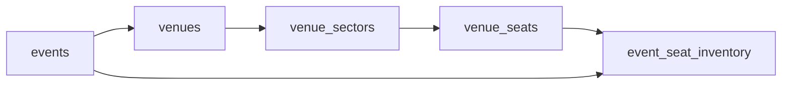
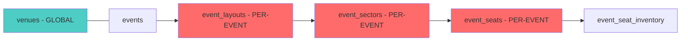
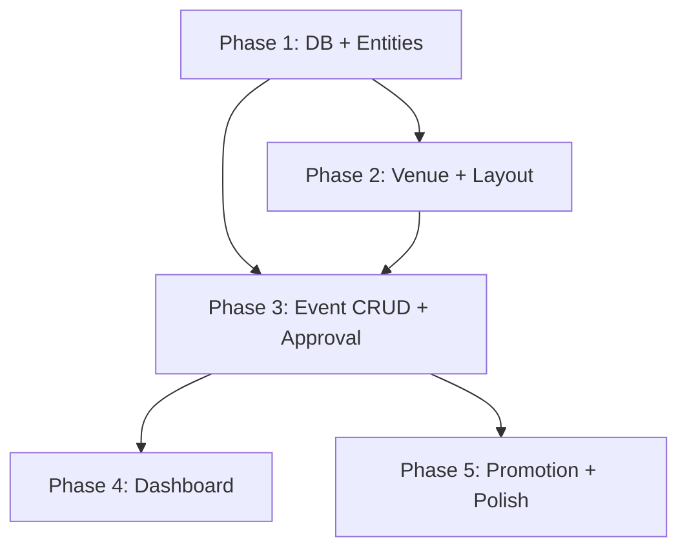

# Phân Tích Database & Kế Hoạch Triển Khai Organizer CRUD APIs (v2)

> **Ngày**: 25/03/2026 | **Scope**: Backend Only | **Mục tiêu**: Production-ready, KHÔNG MVP  
> **Cập nhật**: Phản hồi từ user — hybrid venue model, admin approval, defer Phase 0

---

## 1. PHÂN TÍCH VENUE MODEL: GLOBAL IDENTITY + PER-EVENT LAYOUT

### 1.1. Cách Các Hệ Thống Lớn Triển Khai

| Platform | Venue Identity | Seat Map / Layout | Gắn vào đâu |
|----------|---------------|-------------------|-------------|
| **Ticketmaster** | Global — venue DB chuẩn (tên, GPS, capacity) | Per-event — mỗi show có "manifest" riêng | Event-level |
| **Eventbrite** | Global venue list | Per-event — "Venue Designer" tạo layout riêng cho từng event | Event-level |
| **seats.io** (SaaS) | Không quản lý venue | "Floor Plan" (template) → clone thành "Event" (instance) | Event-level (clone from template) |
| **Nhiều hệ thống nhỏ** | Gắn cứng seats vào venue | — | Venue-level ❌ bị cứng |

**Kết luận ngành**: Tách làm 2 tầng:
- **Venue (Global)**: Tên, địa chỉ, GPS, contact → Admin quản lý, dùng chung
- **Event Layout (Per-event)**: Sectors, seats, seat map → Organizer tùy biến riêng cho mỗi event

### 1.2. Database Hiện Tại Có Đáp Ứng Không?

> **Câu trả lời: ~60% — CẦN RESTRUCTURE một phần**

**Vấn đề hiện tại:**



Hiện tại `venue_sectors` và `venue_seats` gắn **cứng** vào `venues`. Nếu organizer A tổ chức concert ở SVĐ Mỹ Đình với layout 3 sectors, organizer B tổ chức football match cùng venue nhưng layout khác → **không thể**, vì seats gắn cứng vào venue.

**Giải pháp: Thêm tầng `event_layout`**



### 1.3. Migration Plan — Từ Venue-centric → Event-centric Layout

#### Giữ nguyên (không sửa)

| Table | Lý do |
|-------|-------|
| `venues` | Vẫn dùng làm global identity — tên, địa chỉ, GPS |
| `venue_sectors` | **Giữ lại** nhưng đổi vai trò → **Template sectors** (mẫu tham khảo) |
| `venue_seats` | **Giữ lại** → **Template seats** |

#### Tạo mới — Per-event layout tables

##### `event_schema.event_layouts`

```sql
CREATE TABLE event_schema.event_layouts (
    id UUID PRIMARY KEY DEFAULT uuid_generate_v4(),
    event_id UUID NOT NULL REFERENCES event_schema.events(id) ON DELETE CASCADE,
    
    -- Layout metadata
    name VARCHAR(255),                           -- "Concert Layout", "Football Layout"
    
    -- Background image cho seat map (organizer upload)
    background_image_url VARCHAR(500),           -- Cloudinary URL
    background_public_id VARCHAR(255),           -- Cloudinary public_id
    background_width INT,                        -- Ảnh nền chiều rộng (px)
    background_height INT,                       -- Ảnh nền chiều cao (px)
    
    -- Renderer config
    map_config JSONB DEFAULT '{}',               -- zoom levels, viewport, grid settings
    
    -- Source: clone từ template hay tự tạo mới
    source_type VARCHAR(50) DEFAULT 'CUSTOM',    -- CUSTOM, CLONED_FROM_VENUE, CLONED_FROM_EVENT
    source_id UUID,                              -- ID nguồn nếu clone
    
    -- Audit
    created_at TIMESTAMPTZ DEFAULT CURRENT_TIMESTAMP NOT NULL,
    updated_at TIMESTAMPTZ DEFAULT CURRENT_TIMESTAMP NOT NULL,
    created_by VARCHAR(255),
    
    CONSTRAINT uk_event_layout UNIQUE (event_id),  -- 1 event = 1 layout
    CONSTRAINT chk_source_type CHECK (source_type IN ('CUSTOM', 'CLONED_FROM_VENUE', 'CLONED_FROM_EVENT'))
);
```

##### `event_schema.event_sectors`

```sql
CREATE TABLE event_schema.event_sectors (
    id UUID PRIMARY KEY DEFAULT uuid_generate_v4(),
    layout_id UUID NOT NULL REFERENCES event_schema.event_layouts(id) ON DELETE CASCADE,
    
    name VARCHAR(100) NOT NULL,                  -- "Khán đài A", "VIP Zone"
    code VARCHAR(20),                            -- "A", "VIP", "STANDING"
    description TEXT,
    sector_type VARCHAR(50) NOT NULL,            -- SEATED, STANDING, VIP_BOX, ACCESSIBLE
    
    -- Capacity (cho STANDING sectors)
    total_capacity INT NOT NULL,
    
    -- Visual rendering data
    map_data JSONB DEFAULT '{}',                 -- polygon vertices, shape path, rotation
    color_code VARCHAR(7),                       -- "#FF6B6B"
    display_order INT DEFAULT 0,
    is_active BOOLEAN DEFAULT TRUE,
    
    -- Audit
    created_at TIMESTAMPTZ DEFAULT CURRENT_TIMESTAMP NOT NULL,
    updated_at TIMESTAMPTZ DEFAULT CURRENT_TIMESTAMP NOT NULL,
    
    CONSTRAINT chk_sector_type CHECK (sector_type IN ('SEATED', 'STANDING', 'VIP_BOX', 'ACCESSIBLE'))
);
```

##### `event_schema.event_seats`

```sql
CREATE TABLE event_schema.event_seats (
    id UUID PRIMARY KEY DEFAULT uuid_generate_v4(),
    sector_id UUID NOT NULL REFERENCES event_schema.event_sectors(id) ON DELETE CASCADE,
    
    row_name VARCHAR(10) NOT NULL,               -- "A", "B"
    seat_number VARCHAR(10) NOT NULL,            -- "1", "2"
    seat_label VARCHAR(20),                      -- "A-1", "VIP-01"
    
    -- Coordinates trên map (cho renderer)
    coord_x DECIMAL(10,2) NOT NULL,              -- DECIMAL thay vì INT — chính xác hơn
    coord_y DECIMAL(10,2) NOT NULL,
    coord_metadata JSONB DEFAULT '{}',           -- rotation, scale, custom styling
    
    -- Seat properties
    seat_type VARCHAR(50) DEFAULT 'REGULAR',
    is_aisle BOOLEAN DEFAULT FALSE,
    has_obstruction BOOLEAN DEFAULT FALSE,
    is_active BOOLEAN DEFAULT TRUE,
    
    created_at TIMESTAMPTZ DEFAULT CURRENT_TIMESTAMP NOT NULL,
    
    CONSTRAINT chk_seat_type CHECK (seat_type IN ('REGULAR', 'WHEELCHAIR', 'COMPANION', 'PREMIUM', 'RESTRICTED')),
    CONSTRAINT uk_sector_row_seat UNIQUE (sector_id, row_name, seat_number)
);
```

#### Cập nhật bảng hiện có

```sql
-- ticket_types bây giờ reference event_sectors (per-event) thay vì venue_sectors
ALTER TABLE event_schema.ticket_types 
  ADD COLUMN IF NOT EXISTS event_sector_id UUID 
  REFERENCES event_schema.event_sectors(id) ON DELETE SET NULL;

-- event_seat_inventory reference event_seats thay vì venue_seats
-- Bảng event_seat_inventory giữ nguyên cấu trúc, chỉ thay seat_id FK
```

#### Flow sử dụng mới

```
1. Admin tạo Venue (global): SVĐ Mỹ Đình, 1 Lê Đức Thọ, HN
   └── Có thể tạo Template sectors/seats (tùy chọn, không bắt buộc)

2. Organizer chọn venue cho event
   ├── Option A: Clone template → tạo event_layout + event_sectors + event_seats
   ├── Option B: Tạo layout mới từ đầu (upload ảnh, vẽ lên)
   └── Option C: Không cần layout (event standing, GA only)

3. Organizer tùy biến layout:
   ├── Thêm/xóa/sửa sectors
   ├── Vẽ seats lên map (hoặc auto-generate grid)
   └── Gán ticket_types cho sectors

4. Khi publish event:
   └── BE tự động tạo event_seat_inventory cho mỗi seat có ticket_type seated
```

---

## 2. ĐỀ XUẤT SEAT MAP CHO FRONTEND TEAM

### 2.1. Cách Các Hệ Thống Lớn Triển Khai

| Aspect | Ticketmaster | Eventbrite | seats.io |
|--------|-------------|------------|----------|
| **Designer tool** | Internal — không cho organizer vẽ | "Venue Designer" drag-drop | "Chart Designer" in-browser, white-label |
| **Renderer** | Custom WebGL/Canvas | React + SVG | JavaScript SDK (`chart.js`) |
| **Data format** | Proprietary map tiles (Mapbox) | JSON floor plan | JSON (categories, locations, labels) |
| **Seat rendering** | Circles trên grid | SVG circles/rects | SVG/Canvas shapes |
| **Zoom/Pan** | Mapbox zoom (tile-based) | CSS transform | Built-in zoom/pan |
| **Real-time** | WebSocket + CDN | Polling | Pub/Sub push |

### 2.2. Đề Xuất Cho TicketBox — 2 Tool Riêng Biệt

> [!TIP]
> Không cần làm y hệt Ticketmaster (quá overkill). Lấy ý tưởng từ **seats.io + Eventbrite**: Designer tool cho organizer/admin + Renderer cho buyer.

#### Tool 1: **Seat Map Designer** (Organizer/Admin dùng khi tạo event)

**Mục đích**: Cho phép organizer upload ảnh venue → vẽ sectors (vùng) lên ảnh → đặt ghế vào sector → export JSON data cho backend lưu.

**Tech Stack đề xuất:**

| Layer | Công nghệ | Lý do |
|-------|----------|-------|
| **Canvas engine** | **Konva.js** + `react-konva` | Performance tốt nhất với 1000+ interactive objects, scene graph architecture, multi-layer rendering, docs tốt, React binding chính thức |
| **Background image** | Konva `Image` layer | Layer riêng, không re-render khi tương tác với seats |
| **Sectors** | Konva `Line` (closed polygon) | Vẽ tự do hình bất kỳ lên ảnh, drag vertices để chỉnh |
| **Seats** | Konva `Circle` / `Rect` | Render nhanh, click, hover, color-coded |
| **Zoom/Pan** | Konva `Stage` native zoom + drag | Built-in, smooth |
| **Grid snap** | Custom grid overlay | Giúp đặt ghế đều nhau |
| **Auto-generate** | Algorithm → generate seat grid | Nhập rows × seats_per_row → auto fill |
| **State** | Zustand / React Context | Track tất cả shapes, undo/redo |

**Workflow cho organizer:**

```
1. Upload ảnh venue (hoặc chọn từ Cloudinary gallery)
2. Vẽ sector polygons lên ảnh → đặt tên, type (SEATED/STANDING)
3. Với sector SEATED:
   a. Tự vẽ từng ghế (click to place)
   b. HOẶC auto-generate: chọn rows=10, seats_per_row=20 → hệ thống fill 200 ghế vào polygon
4. Set màu sắc, label cho từng sector
5. Preview mode → xem như buyer sẽ thấy
6. Save → export JSON → API POST lên backend
```

**Export JSON Format (FE → BE):**

```json
{
  "backgroundImage": {
    "url": "https://res.cloudinary.com/xxx/image/upload/v123/venue-map.jpg",
    "publicId": "venue-map",
    "width": 1920,
    "height": 1080
  },
  "mapConfig": {
    "minZoom": 0.5,
    "maxZoom": 3.0,
    "defaultZoom": 1.0,
    "gridSize": 30
  },
  "sectors": [
    {
      "tempId": "sector-1",
      "name": "Khán đài A",
      "code": "A",
      "sectorType": "SEATED",
      "totalCapacity": 200,
      "colorCode": "#FF6B6B",
      "displayOrder": 1,
      "mapData": {
        "type": "polygon",
        "vertices": [[100,50],[500,50],[520,300],[80,300]],
        "labelPosition": [300, 175]
      },
      "seats": [
        { "row": "A", "seat": "1", "x": 120.5, "y": 80.0, "type": "REGULAR" },
        { "row": "A", "seat": "2", "x": 150.5, "y": 80.0, "type": "REGULAR" },
        { "row": "A", "seat": "3", "x": 180.5, "y": 80.0, "type": "WHEELCHAIR" }
      ]
    },
    {
      "tempId": "sector-2",
      "name": "Khu đứng",
      "code": "GA",
      "sectorType": "STANDING",
      "totalCapacity": 5000,
      "colorCode": "#95E1D3",
      "displayOrder": 2,
      "mapData": {
        "type": "polygon",
        "vertices": [[50,400],[600,400],[600,700],[50,700]],
        "labelPosition": [325, 550]
      },
      "seats": []
    }
  ]
}
```

#### Tool 2: **Seat Map Viewer** (Buyer dùng khi mua vé)

**Mục đích**: Hiển thị seat map với trạng thái real-time (available/sold/locked), cho buyer chọn ghế.

**Tech Stack:**

| Layer | Công nghệ |
|-------|----------|
| **Renderer** | **Konva.js** (cùng engine với Designer → tái sử dụng render logic) |
| **Real-time status** | WebSocket (Spring WebSocket → push seat status changes) |
| **Color coding** | Available = xanh, Locked = vàng, Sold = xám, Selected = highlight |
| **Interactions** | Click to select, hover to show tooltip (row, seat, price) |
| **Mobile** | Touch events, pinch zoom (Konva native support) |

### 2.3. Tại Sao Konva.js Thay Vì Fabric.js?

| Tiêu chí | Konva.js ✅ | Fabric.js |
|----------|---------|-----------|
| Performance (1000+ objects) | 60fps | Drop frames |
| Scene graph (hierarchy) | Có — Stage → Layer → Group → Shape | Flat canvas |
| Multi-layer rendering | Có — background layer ko re-render khi seats thay đổi | Không |
| React integration | `react-konva` chính thức | Cần wrapper |
| Zoom/Pan | Built-in | Cần custom |
| Event system | Global, efficient | Per-object, tốn memory |
| Documentation | Excellent | OK nhưng kém hơn |

### 2.4. Backend API Contract Cho Seat Map

**Organizer (Design time):**

| Method | Endpoint | Mô tả |
|--------|----------|-------|
| `POST` | `/api/organizer/events/{eventId}/layout` | Tạo/cập nhật layout — nhận full JSON từ FE Designer |
| `GET` | `/api/organizer/events/{eventId}/layout` | Lấy layout data (cho Designer load lại) |
| `DELETE` | `/api/organizer/events/{eventId}/layout` | Xóa toàn bộ layout (reset) |
| `POST` | `/api/organizer/events/{eventId}/layout/clone` | Clone layout từ event khác hoặc venue template |

**Public (Buyer view):**

| Method | Endpoint | Mô tả |
|--------|----------|-------|
| `GET` | `/api/events/{eventId}/seat-map` | Lấy seat map + availability status → cho Viewer render |

**Response format `GET /seat-map` (buyer):**

```json
{
  "eventId": "uuid",
  "layout": {
    "backgroundImageUrl": "...",
    "width": 1920,
    "height": 1080,
    "mapConfig": { "minZoom": 0.5, "maxZoom": 3.0 }
  },
  "sectors": [
    {
      "id": "uuid",
      "name": "Khán đài A",
      "sectorType": "SEATED",
      "ticketTypeId": "uuid",
      "ticketTypeName": "VIP",
      "price": 1500000,
      "mapData": { "vertices": [...], "color": "#FF6B6B" },
      "seats": [
        { "id": "uuid", "row": "A", "seat": "1", "x": 120.5, "y": 80.0, "status": "AVAILABLE" },
        { "id": "uuid", "row": "A", "seat": "2", "x": 150.5, "y": 80.0, "status": "SOLD" },
        { "id": "uuid", "row": "A", "seat": "3", "x": 180.5, "y": 80.0, "status": "LOCKED" }
      ]
    },
    {
      "id": "uuid",
      "name": "Khu đứng",
      "sectorType": "STANDING",
      "ticketTypeId": "uuid",
      "ticketTypeName": "GA",
      "price": 300000,
      "remaining": 4250,
      "total": 5000,
      "mapData": { "vertices": [...], "color": "#95E1D3" },
      "seats": []
    }
  ]
}
```

---

## 3. KẾ HOẠCH TRIỂN KHAI — 5 PHASES (Updated)

### Quyết Định Đã Xác Nhận

- ✅ Venue = global (Admin quản lý), Layout = per-event (Organizer tùy biến)
- ✅ Admin approval: `DRAFT → PENDING_APPROVAL → PUBLISHED`  
- ✅ Phase 0 hardening: tạm hoãn, ưu tiên demo features
- ⏳ SeatBookingStrategy: chưa xác nhận → tạm chỉ build seat map CRUD, booking seated tính sau

---

### PHASE 1: Database Migration & Entity Layer (3-4 ngày)

**Mục tiêu**: Schema sẵn sàng cho event-centric layout model

#### Tasks

- [ ] Tạo `V6__event_layout_tables.sql`:
  - Tạo `event_layouts`, `event_sectors`, `event_seats`
  - Thêm `event_sector_id` vào `ticket_types`
  - Thêm `seat_map_config JSONB` vào `venues`
  - **KHÔNG xóa** `venue_sectors`, `venue_seats` (giữ làm template)
  - Thêm status `PENDING_APPROVAL` vào `events.status` CHECK constraint
- [ ] Tạo/Cập nhật JPA Entities:
  - `EventLayout.java`, `EventSector.java`, `EventSeat.java`
  - Update `Event.java` — add `@OneToOne EventLayout`
  - Update `TicketType.java` — add `eventSectorId`
  - `Venue.java`, `VenueSector.java`, `VenueSeat.java` (template entities)
- [ ] Tạo Repositories với custom queries
- [ ] Unit test entities + repositories

---

### PHASE 2: Venue (Global) + Event Layout CRUD (5-7 ngày)

**Mục tiêu**: Admin quản lý venues, Organizer tạo/tùy biến layout per-event

#### 2.1 Venue CRUD (Admin)

| Method | Endpoint | Auth |
|--------|----------|------|
| `GET` | `/api/venues` | Public |
| `GET` | `/api/venues/{id}` | Public |
| `POST` | `/api/admin/venues` | ADMIN |
| `PUT` | `/api/admin/venues/{id}` | ADMIN |
| `DELETE` | `/api/admin/venues/{id}` | ADMIN |

> [!NOTE]
> Venue templates (sectors/seats gắn vào venue) là optional — Admin có thể tạo template layout cho venue, organizer clone khi cần. Nhưng **không bắt buộc**.

#### 2.2 Event Layout CRUD (Organizer)

| Method | Endpoint | Auth | Mô tả |
|--------|----------|------|-------|
| `POST` | `/api/organizer/events/{eventId}/layout` | ORGANIZER | Tạo/cập nhật layout — nhận full JSON |
| `GET` | `/api/organizer/events/{eventId}/layout` | ORGANIZER | Get layout (cho Designer load lại) |
| `DELETE` | `/api/organizer/events/{eventId}/layout` | ORGANIZER | Reset layout |
| `POST` | `/api/organizer/events/{eventId}/layout/clone` | ORGANIZER | Clone từ event/venue template |

**Key implementation:**
- `POST /layout` nhận toàn bộ JSON (xem mục 2.2 phía trên), BE parse → bulk insert `event_sectors` + `event_seats`
- Idempotent: gọi lại = xóa cũ + insert mới (transaction)
- Validation: sector polygons hợp lệ, seat coordinates nằm trong bounds

---

### PHASE 3: Event CRUD + Ticket Type + Approval (7-10 ngày)

**Mục tiêu**: Organizer tạo/sửa/xóa event, Admin duyệt publish

#### 3.1 Event APIs

| Method | Endpoint | Auth | Mô tả |
|--------|----------|------|-------|
| `POST` | `/api/organizer/events` | ORGANIZER | Tạo event (DRAFT) |
| `GET` | `/api/organizer/events` | ORGANIZER | My events + filter/paginate |
| `GET` | `/api/organizer/events/{id}` | ORGANIZER | Chi tiết (organizer view) |
| `PUT` | `/api/organizer/events/{id}` | ORGANIZER | Full update |
| `PATCH` | `/api/organizer/events/{id}` | ORGANIZER | Partial update |
| `DELETE` | `/api/organizer/events/{id}` | ORGANIZER | Soft delete |
| `PATCH` | `/api/organizer/events/{id}/submit` | ORGANIZER | Submit for review (DRAFT → PENDING_APPROVAL) |
| `PATCH` | `/api/organizer/events/{id}/cancel` | ORGANIZER | Cancel event |
| `POST` | `/api/organizer/events/{id}/duplicate` | ORGANIZER | Clone event |

#### 3.2 Admin Approval APIs

| Method | Endpoint | Auth | Mô tả |
|--------|----------|------|-------|
| `GET` | `/api/admin/events` | ADMIN | All events + filter status |
| `GET` | `/api/admin/events/pending` | ADMIN | Events chờ duyệt |
| `PATCH` | `/api/admin/events/{id}/approve` | ADMIN | Approve → PUBLISHED |
| `PATCH` | `/api/admin/events/{id}/reject` | ADMIN | Reject + lý do → DRAFT |
| `PATCH` | `/api/admin/events/{id}/feature` | ADMIN | Đánh dấu featured |

#### 3.3 Event Status Flow (Updated)

```
DRAFT ──submit──→ PENDING_APPROVAL ──approve──→ PUBLISHED ──→ COMPLETED
  ↑                     │                         │
  └──────reject─────────┘                    ──cancel──→ CANCELLED
                                                  │
                                             ──sold_out──→ SOLD_OUT
```

#### 3.4 Ticket Type CRUD

| Method | Endpoint | Auth |
|--------|----------|------|
| `POST` | `/api/organizer/events/{eventId}/ticket-types` | ORGANIZER |
| `PUT` | `/api/organizer/events/{eventId}/ticket-types/{id}` | ORGANIZER |
| `DELETE` | `/api/organizer/events/{eventId}/ticket-types/{id}` | ORGANIZER |
| `PATCH` | `.../{id}/visibility` | ORGANIZER |
| `POST` | `.../{id}/seats/setup` | ORGANIZER |

**Seated ticket setup flow:**
1. Organizer tạo ticket type với `seatSelectionEnabled = true`
2. Chọn `event_sector_id` (phải là sector thuộc event layout)
3. BE tự động tạo `event_seat_inventory` records cho mỗi seat trong sector
4. `quantity_total` = số seats active trong sector

#### 3.5 Publish Validation Rules

Event chỉ được submit for approval khi:
- ✅ Có title, description, categories
- ✅ `start_datetime` > now + 24h
- ✅ `end_datetime` > `start_datetime`
- ✅ Ít nhất 1 ticket type ACTIVE
- ✅ Ticket types có `price >= 0` và `quantity_total > 0`
- ✅ Có venue hoặc `is_online = true`
- ✅ Nếu có seated ticket type → layout + inventory đã setup
- ✅ Ít nhất 1 BANNER image

---

### PHASE 4: Dashboard & Analytics (5-7 ngày)

| Method | Endpoint | Auth | Mô tả |
|--------|----------|------|-------|
| `GET` | `/api/organizer/dashboard/overview` | ORGANIZER | Tổng quan |
| `GET` | `/api/organizer/dashboard/revenue-chart` | ORGANIZER | Doanh thu theo thời gian |
| `GET` | `/api/organizer/events/{id}/stats` | ORGANIZER | Stats per-event |
| `GET` | `/api/organizer/events/{id}/orders` | ORGANIZER | Đơn hàng per-event |
| `GET` | `/api/organizer/events/{id}/attendees` | ORGANIZER | Danh sách attendees |
| `GET` | `/api/organizer/events/{id}/checkin-stats` | ORGANIZER | Thống kê check-in |
| `GET` | `/api/organizer/events/{id}/seat-map/status` | ORGANIZER | Seat map realtime |
| `GET` | `.../{id}/revenue/export` | ORGANIZER | Export CSV/Excel |
| `GET` | `/api/admin/dashboard` | ADMIN | Admin system overview |

---

### PHASE 5: Promotion CRUD + Image Management + Polish (5-7 ngày)

#### Promotion APIs

| Method | Endpoint | Auth |
|--------|----------|------|
| `POST` | `/api/organizer/promotions` | ORGANIZER |
| `GET` | `/api/organizer/promotions` | ORGANIZER |
| `PUT` | `/api/organizer/promotions/{id}` | ORGANIZER |
| `DELETE` | `/api/organizer/promotions/{id}` | ORGANIZER |
| `PATCH` | `.../{id}/status` | ORGANIZER |
| `GET` | `.../{id}/usages` | ORGANIZER |

#### Image Management (mở rộng)

| Method | Endpoint | Auth |
|--------|----------|------|
| `PUT` | `/api/organizer/events/{id}/images/{imageId}` | ORGANIZER |
| `PATCH` | `/api/organizer/events/{id}/images/reorder` | ORGANIZER |

#### Public Seat Map API

| Method | Endpoint | Auth |
|--------|----------|------|
| `GET` | `/api/events/{eventId}/seat-map` | Public |

---

## 4. TIMELINE

| Phase | Nội dung | Effort | Tích lũy |
|:-----:|----------|:------:|:--------:|
| **1** | DB Migration + Entities | 3-4 ngày | 4 ngày |
| **2** | Venue + Event Layout CRUD | 5-7 ngày | 11 ngày |
| **3** | Event CRUD + Approval + Ticket Types | 7-10 ngày | 21 ngày |
| **4** | Dashboard + Analytics | 5-7 ngày | 28 ngày |
| **5** | Promotion + Polish | 5-7 ngày | 35 ngày |

**Tổng: ~5-7 tuần** full-time

---

## 5. DEPENDENCIES



---

## 6. QUYẾT ĐỊNH CÒN LẠI

| # | Câu hỏi | Trạng thái |
|:-:|---------|:----------:|
| 1 | Venue ownership → Hybrid (global + per-event layout) | ✅ Đã quyết |
| 2 | Seat map tech → Konva.js + JSON export | ✅ Đã đề xuất |
| 3 | Event approval → Admin duyệt | ✅ Đã quyết |
| 4 | SeatBookingStrategy (booking ghế cụ thể) | ⏳ Tạm hoãn — chỉ build CRUD trước |
| 5 | Phase 0 hardening | ⏳ Tạm hoãn — ưu tiên demo |
