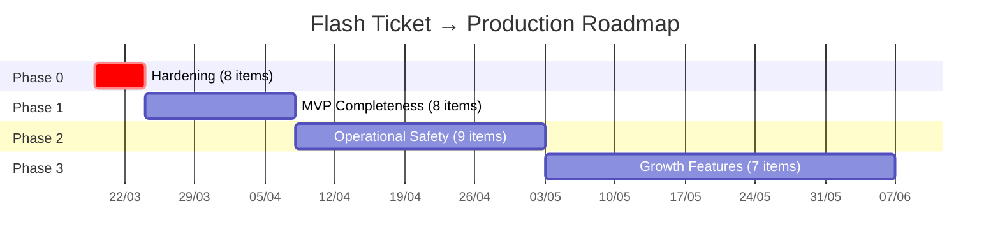

# Flash Ticket System — Lộ Trình Triển Khai Production

> Tổng hợp từ 3 audit: [Flow Trace Analysis](file:///C:/Users/84583/.gemini/antigravity/brain/302148de-d25c-4a5f-b5cf-c8ad21612038/flow_trace_analysis.md), [Concurrency Audit](file:///C:/Users/84583/.gemini/antigravity/brain/302148de-d25c-4a5f-b5cf-c8ad21612038/concurrency_audit.md), [Production Readiness Audit](file:///C:/Users/84583/.gemini/antigravity/brain/302148de-d25c-4a5f-b5cf-c8ad21612038/production_readiness_audit.md).
>
> **Nguyên tắc:** Tiền → Dữ liệu → Vận hành → Tính năng mới.

---

## Phase 0: Hardening — Mục tiêu: Không mất tiền, không mất dữ liệu

> ⏱️ Hoàn thành trong **< 1 tuần** bởi 1 engineer. Không ship bất cứ tính năng mới nào trước khi Phase 0 xong.

| # | Hạng Mục | Tại Sao | Effort | Rủi Ro | Phụ Thuộc |
|:-:|----------|---------|:------:|--------|-----------|
| 0.1 | **Sửa race condition Order Expiry vs IPN** — Thêm `WHERE status = 'PENDING'` vào `OrderExpirationHelper.expireOne()` | User trả tiền thành công nhưng order bị chuyển EXPIRED → mất tiền. Concurrency Audit Area 1. | S | 🔴 HIGH — Luồng tiền bị tổn hại trực tiếp | Không |
| 0.2 | **Thêm ShedLock cho `OrderExpirationService`** — Ngăn 2 pod chạy scheduler đồng thời | Multi-pod triển khai → `restoreQuantity()` chạy 2 lần → stock bị thổi phồng → oversell. Concurrency Audit Area 5C. | S | 🔴 HIGH — Oversell dưới bất kỳ deployment nào có >1 pod | 0.1 (cùng file, nên sửa chung) |
| 0.3 | **Xóa `ON DELETE CASCADE` trên bảng tài chính** — `order_items`, `tickets`, `transactions` đổi sang `RESTRICT` | Một lệnh DELETE cứng vào `orders` xóa sạch lịch sử thanh toán không phục hồi được. Production Readiness D4. | S | 🔴 HIGH — Mất dữ liệu không thể phục hồi | Không |
| 0.4 | **Bật Graceful Shutdown** — `server.shutdown: graceful` + `timeout-per-shutdown-phase: 30s` | Pod restart cắt ngang VNPay IPN = Transaction SUCCESS nhưng Order chưa CONFIRMED. Production Readiness D5. | S | 🔴 HIGH — Mất tiền khi deploy/restart | Không |
| 0.5 | **Xóa hardcoded QR secret fallback + VNPay sandbox defaults** — App phải fail fast nếu thiếu env var | Quên set env var → QR bị giả mạo / thanh toán đi sandbox. Production Readiness D3. | S | 🔴 HIGH — Lỗ hổng bảo mật + mất tiền thật | Không |
| 0.6 | **Hạn chế Actuator endpoints** — `include: health,info,metrics,prometheus` thay vì `"*"` | `/actuator/env` leak credentials (DB password, VNPay hash secret). Production Readiness D3. | S | 🟠 MEDIUM — Lộ secret trên production | Không |
| 0.7 | **Tắt `show-sql` + giảm log level** — `show-sql: false`, log level `INFO` trong profile prod | `show-sql: true` giảm throughput 30-50% dưới tải. DEBUG logging gây nhiễu và tốn disk. | S | 🟡 LOW — Ảnh hưởng hiệu năng, không mất dữ liệu | Không |
| 0.8 | **Gọi `confirmPromotion()` sau IPN thành công** — Thêm call trong `VNPayIPNService.confirmOrder()` | Promotion slot "reserved" mãi mãi sau khi thanh toán → leak slot → user khác không dùng được voucher. Flow Trace A-1. | S | 🟡 LOW — Voucher bị kẹt nhưng không mất tiền | Không |

**Tổng Phase 0:** ~4-5 ngày (bao gồm test). Tất cả items đều size S, có thể làm song song hoặc liên tục.

---

## Phase 1: MVP Completeness — Mục tiêu: Sự kiện đầu tiên go-live

> ⏱️ ~2-3 tuần. Tập trung vào "Buyer trả tiền → Buyer nhận vé → Organizer nhận tiền → Staff check-in" end-to-end.

| # | Hạng Mục | Tại Sao | Effort | Rủi Ro | Phụ Thuộc |
|:-:|----------|---------|:------:|--------|-----------|
| 1.1 | **API tạo sự kiện cho Organizer** — `POST /api/organizer/events` + quản lý ticket types | Không có endpoint tạo event → organizer không thể dùng platform. Gap analysis: CRITICAL blocker. | L | 🟠 MEDIUM — Thiết kế API mới, cần validate schema kỹ | Phase 0 |
| 1.2 | **Payment Status Polling cải tiến** — Thêm `expiresAt` vào `PaymentStatusResponse` | Frontend bị kẹt "đang xử lý" mãi khi IPN chậm. Concurrency Audit Area 4. | S | 🟡 LOW — Thay đổi DTO, không ảnh hưởng logic | Phase 0 |
| 1.3 | **DLQ Consumer cho `q.ticket.issue.dlq`** — Retry ticket issuance với exponential backoff | Vé đã thanh toán nhưng không được cấp (Cloudinary/DB lỗi tạm) → buyer mất tiền. Flow Trace D3. | M | 🟠 MEDIUM — Cần idempotency chính xác khi retry | Phase 0 |
| 1.4 | **DLQ Consumer cho `q.email.send.dlq`** — Retry gửi email với backoff | Buyer không nhận được email QR → phải liên hệ support thủ công. Flow Trace D2. | M | 🟡 LOW — Email fail không mất tiền, chỉ ảnh hưởng UX | 1.3 (cùng pattern) |
| 1.5 | **API xem ticket + download QR** — `GET /api/tickets/my-tickets`, `GET /api/tickets/{id}/qr` | Nếu email bị thất lạc, buyer cần tự lấy QR. Đây là plan B bắt buộc cho go-live. | M | 🟡 LOW — Read-only API, rủi ro thấp | Phase 0 |
| 1.6 | **Organizer: Xem danh sách đơn hàng + doanh thu** — `GET /api/organizer/events/{id}/orders`, `/revenue` | Organizer cần biết có bao nhiêu vé bán được, doanh thu bao nhiêu. Thiếu = không ký hợp đồng. | M | 🟡 LOW — Read-only queries + aggregation | 1.1 |
| 1.7 | **`@PreAuthorize` cho tất cả API nhạy cảm** — Check-in, organizer endpoints, cancel order | Thiếu authorization → bất kỳ user đăng nhập có thể check-in vé người khác. Gap analysis: Security. | M | 🟠 MEDIUM — Review từng endpoint, dễ miss | Phase 0 |
| 1.8 | **Bật Flyway migration** — Thêm dependency + bỏ comment config + di chuyển V*.sql | Schema drift giữa dev/staging/prod → rollback impossible. Production Readiness D4. | S | 🟡 LOW — Cần `baseline-on-migrate: true` cho DB hiện tại | Phase 0 |

**Milestone Phase 1:** Chạy 1 sự kiện nhỏ (< 500 vé) với organizer thật. Toàn bộ flow booking → payment → ticket → check-in hoạt động end-to-end.

---

## Phase 2: Operational Safety — Mục tiêu: Platform tự vận hành

> ⏱️ ~3-4 tuần. Sau khi sự kiện đầu tiên chạy thành công, harden cho flash sale và multi-event.

| # | Hạng Mục | Tại Sao | Effort | Rủi Ro | Phụ Thuộc |
|:-:|----------|---------|:------:|--------|-----------|
| 2.1 | **Refund Flow (buyer-initiated)** — `POST /api/orders/{id}/refund` + VNPay Refund API | Buyer trả tiền rồi muốn hoàn → hiện không có cách nào. Cần ADR trước khi implement (xem Risk Register). | L | 🔴 HIGH — Tích hợp VNPay Refund API lần đầu, cần test kỹ sandbox | Phase 1, ADR-1 |
| 2.2 | **Payment Reconciliation Scheduler** — Query VNPay QueryDR API cho PENDING transactions | IPN không đến → user trả tiền nhưng order expire → mất tiền. Flow Trace B2-1 (CRITICAL). | L | 🔴 HIGH — Tích hợp VNPay QueryDR API mới, cần ADR. | Phase 1, ADR-2 |
| 2.3 | **Observability Stack** — Structured logging (logback-spring.xml + JSON) + MDC filter + Micrometer Prometheus | Không thể debug production incidents. Không có metrics → không biết hệ thống có vấn đề cho đến khi user phàn nàn. | L | 🟡 LOW — Thay đổi infra, không ảnh hưởng business logic | Phase 0 |
| 2.4 | **Circuit Breaker cho Cloudinary + SMTP** — Resilience4j wrap external calls | Cloudinary down → RabbitMQ consumer bị block → message accumulate → RabbitMQ disk alarm → toàn bộ publisher bị chặn. | M | 🟠 MEDIUM — Cần tune thresholds dựa trên traffic thực | 2.3 (cần metrics để monitor) |
| 2.5 | **Event Cancellation + Bulk Refund** — Organizer/Admin cancel event → batch refund tất cả orders | Sự kiện bị hủy (thiên tai, ca sĩ ốm) → cần hoàn tiền hàng loạt. Không có = phải refund thủ công từng order. | XL | 🔴 HIGH — Batch VNPay refund, notification hàng loạt | 2.1 (cần RefundService hoạt động trước) |
| 2.6 | **Fix promotion per-user TOCTOU** — Redis `SetNx` guard trước per-user DB check | 2 tab cùng user dùng cùng voucher cho event khác → bypass per-user limit. Concurrency Audit Area 2. | S | 🟡 LOW — Blast radius giới hạn bởi global atomic check | Phase 0.8 |
| 2.7 | **QR Reconciliation Job** — `@Scheduled` retry Cloudinary upload cho tickets có `qrCodeImageUrl = null` | Cloudinary down tạm → tickets tạo thành công nhưng không có ảnh QR. Hiện không có retry. Flow Trace D1. | S | 🟡 LOW — Không mất tiền, chỉ thiếu ảnh QR | Phase 0 |
| 2.8 | **Admin Dashboard APIs** — User management, event approval/reject, system metrics | Platform cần governance — admin duyệt event trước khi publish, quản lý user violations. | L | 🟡 LOW — CRUD API chuẩn, rủi ro kỹ thuật thấp | Phase 1 |
| 2.9 | **HikariCP connection pool tuning** — `maximum-pool-size: 30`, `minimum-idle: 10` | Mặc định 10 connections — flash sale với 50+ concurrent bookings → pool exhaustion → timeout cascade. | S | 🟡 LOW — Config change, cần load test xác nhận | Phase 0 |

**Milestone Phase 2:** Chạy flash sale (1000+ concurrent users). Platform tự recover khi Cloudinary/SMTP down. Refund flow hoàn chỉnh.

---

## Phase 3: Growth Features — Mục tiêu: Scale lên nhiều organizer + event types

> ⏱️ ~4-6 tuần. Chỉ bắt đầu sau khi Phase 2 ổn định qua ít nhất 3 sự kiện production.

| # | Hạng Mục | Tại Sao | Effort | Rủi Ro | Phụ Thuộc |
|:-:|----------|---------|:------:|--------|-----------|
| 3.1 | **Seat Selection Flow (Phase 2D)** — Interactive seat map + per-seat locking | Sự kiện premium (concert, theater) yêu cầu chọn ghế. Entity `Ticket.seatId` + `TicketReservation.acquireSeatLock()` đã thiết kế. | XL | 🟠 MEDIUM — UI phức tạp + per-seat Redis lock thay vì per-zone | Phase 2 |
| 3.2 | **Ticket Transfer** — `POST /api/tickets/{id}/transfer` + validate ownership + PESSIMISTIC_WRITE | Entity có `isTransferable`, `transferredFromTicketId`, `TicketStatus.TRANSFERRED` nhưng zero logic. Cần cho user chia sẻ vé. | L | 🟠 MEDIUM — Cần guard chống circular transfer + double transfer | Phase 2 |
| 3.3 | **WebSocket Payment Notification** — Replace polling với push sau IPN success | UX tốt hơn — buyer nhận thông báo tức thì thay vì chờ polling. AI_CONTEXT roadmap Phase 2C. | M | 🟡 LOW — Additive feature, không thay đổi flow hiện tại | Phase 2 |
| 3.4 | **Multi-organizer Revenue Settlement** — Tách commission, payout reporting | Nhiều organizer → cần hệ thống tính phí nền tảng + báo cáo payout. Monetization model. | XL | 🟠 MEDIUM — Logic tài chính mới, cần kế toán review | 2.1, 2.8 |
| 3.5 | **Promotion Scope: Specific Events** — `applicable_event_ids` filter | `PromotionService` L96 TODO: Hiện tất cả events đều áp dụng mọi voucher. Cần giới hạn theo event. | M | 🟡 LOW — Thêm filter vào `reservePromotion()` | Phase 0.8 |
| 3.6 | **user-service build-out** — Profile management, preferences, booking history | Hiện gần như empty shell. Cần cho user self-service. | L | 🟡 LOW — New service, ít ảnh hưởng core | Phase 1 |
| 3.7 | **Distributed Tracing** — Micrometer Tracing + Zipkin/Tempo cross-service | Khi có 3+ services (core, user, gateway), cần trace request xuyên suốt. | M | 🟡 LOW — Infra change, không ảnh hưởng logic | 2.3 |

**Milestone Phase 3:** Platform hỗ trợ 10+ organizer đồng thời, sự kiện có chọn ghế, 5000+ concurrent users flash sale.

---

## Risk Register — Top 3 Items Cần ADR

### ADR-1: Refund Policy & VNPay Refund API Integration

**Quyết định cần đưa ra:**
- Full refund only hay hỗ trợ partial refund?
- Refund window: bao lâu trước sự kiện? (VD: chỉ trước 24h)
- Auto-approve hay cần organizer/admin duyệt?
- VNPay Refund API (`vnp_Command = refund`) có yêu cầu gì đặc biệt? (Xác minh sandbox)

**Options:**
1. **Auto-refund với rules** — refund tự động nếu thỏa điều kiện (< 24h trước event, vé chưa USED). Nhanh nhưng rủi ro fraud.
2. **Admin-approval workflow** — buyer request → admin review → approve/reject. An toàn nhưng chậm, cần UI.
3. **Hybrid** — auto nếu < X VND, manual nếu > X VND. Cân bằng.

> **Recommendation:** Option 3 — auto-refund cho đơn < 500K VND, manual cho đơn lớn hơn. Bắt đầu với Option 2 trong MVP.

---

### ADR-2: Payment Reconciliation Strategy

**Quyết định cần đưa ra:**
- Khi phát hiện Transaction PENDING nhưng VNPay xác nhận đã thanh toán (qua QueryDR): tự động confirm order hay flag cho admin?
- Nếu order đã EXPIRED và stock đã bán cho người khác → refund tự động hay oversell?
- Frequency: mỗi 5 phút? 15 phút? Real-time webhook?

**Options:**
1. **Auto-restore** — query VNPay, nếu paid → un-expire order + re-reserve stock (nếu còn). Phức tạp, cần atomic stock check.
2. **Auto-refund** — query VNPay, nếu paid + order EXPIRED → tự động refund qua VNPay Refund API. Đơn giản hơn nhưng buyer mất vé.
3. **Admin queue** — flag anomaly, admin quyết định case-by-case. An toàn nhất nhưng manual.

> **Recommendation:** Option 2 làm default (auto-refund), Option 1 chỉ khi stock vẫn còn. Logic: `if stockAvailable → restore; else → refund`.

---

### ADR-3: Multi-Pod Scheduler Strategy

**Quyết định cần đưa ra:**
- Dùng ShedLock (đơn giản, Redis-based) hay Spring Integration Leader Election (phức tạp hơn)?
- Áp dụng cho scheduler nào? Chỉ `OrderExpirationService` hay tất cả future schedulers?
- `SELECT FOR UPDATE SKIP LOCKED` có cần bổ sung hay ShedLock đủ?

**Options:**
1. **ShedLock only** — thêm `@SchedulerLock` trên mỗi `@Scheduled` method. Lock qua Redis (đã có Redisson).
2. **ShedLock + SKIP LOCKED** — defense-in-depth: Lock scheduler + lock rows. Chống cả edge case ShedLock Redis failover.
3. **Single scheduler pod** — deploy 1 pod riêng chạy scheduler, pods khác disable `@EnableScheduling`. Đơn giản nhưng single point of failure.

> **Recommendation:** Option 1 cho ngay bây giờ (Phase 0.2). Upgrade lên Option 2 khi traffic > 1000 concurrent.

---

## 🔥 Immediate Action Items — Sửa TUẦN NÀY

> 5 thay đổi cụ thể, không cần ADR, không thay đổi architecture. Có thể merge trong 1-2 ngày.

### 1. `OrderExpirationHelper.java` — Conditional UPDATE

```java
// Thay thế: order.setStatus(Order.OrderStatus.EXPIRED); orderRepository.save(order);
// Bằng:
int updated = orderRepository.updateStatusToExpired(order.getId());
if (updated == 0) {
    log.info("Order {} đã được xử lý (IPN đã confirm), bỏ qua expiry", order.getOrderNumber());
    return;
}
bookingService.restoreStock(order.getId());
promotionService.releasePromotion(order.getPromotionId());
```

### 2. `core-service.yml` — 4 dòng config

```yaml
server:
  shutdown: graceful                    # ← THÊM

spring:
  lifecycle:
    timeout-per-shutdown-phase: 30s     # ← THÊM

management:
  endpoints:
    web:
      exposure:
        include: health,info,metrics    # ← SỬA từ "*"
```

### 3. `core-service.yml` — Xóa hardcoded defaults

```yaml
app:
  qr:
    secret-key: ${QR_SECRET_KEY}                  # ← XÓA default

vnpay:
  payment-url: ${VNPAY_PAYMENT_URL}               # ← XÓA sandbox default
  return-url: ${VNPAY_RETURN_URL}                  # ← XÓA localhost default
  api-url: ${VNPAY_API_URL}                        # ← XÓA sandbox default
```

### 4. `V6__remove_dangerous_cascades.sql` — Tạo migration mới

```sql
ALTER TABLE booking_schema.order_items
  DROP CONSTRAINT order_items_order_id_fkey,
  ADD CONSTRAINT order_items_order_id_fkey
    FOREIGN KEY (order_id) REFERENCES booking_schema.orders(id) ON DELETE RESTRICT;

ALTER TABLE booking_schema.tickets
  DROP CONSTRAINT tickets_order_item_id_fkey,
  ADD CONSTRAINT tickets_order_item_id_fkey
    FOREIGN KEY (order_item_id) REFERENCES booking_schema.order_items(id) ON DELETE RESTRICT;

ALTER TABLE payment_schema.transactions
  DROP CONSTRAINT transactions_order_id_fkey,
  ADD CONSTRAINT transactions_order_id_fkey
    FOREIGN KEY (order_id) REFERENCES booking_schema.orders(id) ON DELETE RESTRICT;
```

### 5. `VNPayIPNService.java` — Gọi `confirmPromotion()` trong `confirmOrder()`

```java
// Trong confirmOrder(), sau order.setStatus(CONFIRMED):
if (order.getPromotionId() != null) {
    promotionService.confirmPromotion(
        order.getPromotionId(),
        order.getUserId(),
        order.getId(),
        order.getDiscountAmount()
    );
}
```

---

## Timeline Tổng Quan


