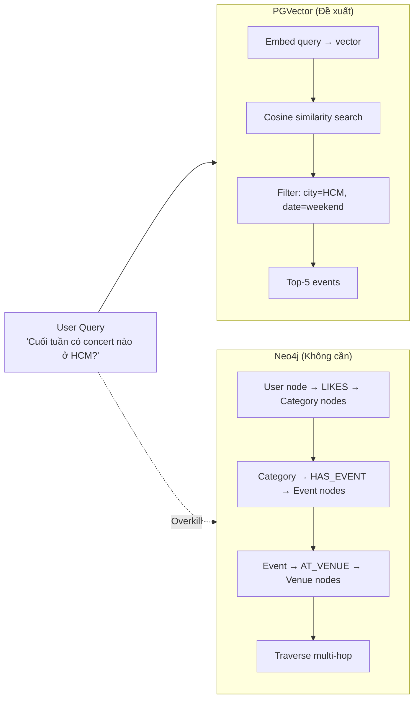
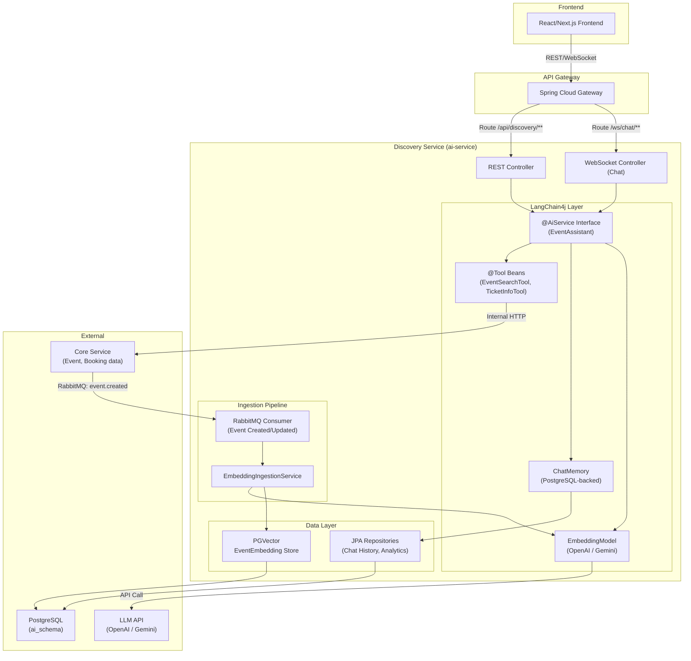

# Tư vấn AI Service — Flash Ticket System

> **Tài liệu tư vấn kiến trúc & nghiệp vụ**
> Dành cho: Lê Minh — Flash Ticket System
> Ngày: 07/04/2026

---

## Mục lục

1. [Đặt tên Service](#1-đặt-tên-service)
2. [Vector DB vs Graph DB — Chọn cái nào?](#2-vector-db-vs-graph-db)
3. [LangChain4j vs Spring AI — Xác nhận lựa chọn](#3-langchain4j-vs-spring-ai)
4. [Trải nghiệm người dùng - AI mang lại gì?](#4-trải-nghiệm-người-dùng)
5. [Kiến trúc kỹ thuật chi tiết](#5-kiến-trúc-kỹ-thuật)
6. [Lộ trình triển khai đề xuất](#6-lộ-trình-triển-khai)
7. [Câu hỏi cần xác nhận](#7-câu-hỏi-cần-xác-nhận)

---

## 1. Đặt tên Service

### Vấn đề với tên "ai-service"

Tên `ai-service` quá chung chung và mang tính buzzword. Nó không cho developer hay stakeholder biết service này **làm gì**. Trong kiến trúc microservices, tên service nên phản ánh **business capability** chứ không phải technology.

### Đề xuất tên

| Tên | Ý nghĩa | Đánh giá |
|-----|---------|----------|
| `ai-service` | Service dùng AI | ❌ Quá generic, không mô tả nghiệp vụ |
| `recommendation-service` | Hệ thống gợi ý | ⚠️ Thiếu chatbot + search |
| `search-service` | Tìm kiếm | ⚠️ Thiếu chatbot + recommendations |
| **`discovery-service`** | **Khám phá sự kiện** | **✅ Bao quát: Search + Recommend + Chat** |
| `intelligent-service` | Service thông minh | ❌ Lại là buzzword |

### Khuyến nghị: **`discovery-service`**

**Lý do:**
1. **Mô tả đúng nghiệp vụ:** Service này giúp user *khám phá* (discover) sự kiện — qua tìm kiếm thông minh, gợi ý cá nhân, và chatbot.
2. **Chuyên nghiệp hơn:** Các nền tảng lớn (Spotify Discovery, Netflix, Eventbrite) đều dùng khái niệm "discovery" cho tính năng AI/ML.
3. **Không bị lock vào công nghệ:** Nếu sau này chuyển từ LLM sang rule-based hoặc collaborative filtering, tên vẫn phù hợp.
4. **Package name:** `com.flashticket.discovery` — sạch và rõ ràng.

### Nếu muốn giữ "ai-service"

Nếu bạn muốn giữ `ai-service` cho mục đích demo/academic (để người xem biết ngay đây là AI), điều đó hoàn toàn hợp lý. Chỉ cần lưu ý rằng trong production thật sự, convention là đặt tên theo business domain.

> **Quyết định của bạn:** Chọn `discovery-service` hay giữ `ai-service`?

---

## 2. Vector DB vs Graph DB

### TL;DR: Bắt đầu với PGVector, KHÔNG cần Graph DB ở giai đoạn này.

### So sánh chi tiết cho Flash Ticket



### Tại sao PGVector là đúng cho Flash Ticket?

| Tiêu chí | PGVector | Neo4j |
|----------|---------|-------|
| **Dữ liệu Flash Ticket** | Event = text (title, description, tags) → vector search khớp hoàn hảo | Event relationships đơn giản (Event→Venue, Event→Category) — KHÔNG cần graph traversal |
| **Infra complexity** | Dùng chung PostgreSQL hiện tại — zero thêm infra | Thêm 1 database engine hoàn toàn mới, thêm ops burden |
| **Query pattern** | "Tìm event giống X" ✅ "Event ở HCM cuối tuần" ✅ | "User A mua vé event X, event X cùng organizer với Y, Y có similarity với Z" → quá phức tạp cho hệ thống hiện tại |
| **LangChain4j support** | `langchain4j-pgvector` — mature, production-ready | `langchain4j-neo4j` — có nhưng ít dùng trong ticketing |
| **Hybrid Search** | Vector + Full-Text Search + RRF (Reciprocal Rank Fusion) — MẠNH | Vector index có nhưng không native FTS |
| **Learning curve** | SQL + thêm vài hàm vector — rất nhanh | Cypher query language + graph modeling — đường cong học dốc |

### Khi nào MỚI cần Graph DB?

Graph DB trở nên cần thiết khi:
- **Multi-hop reasoning:** "Những người mua vé concert của Sơn Tùng cũng thường xem show của ai?" → cần traverse User→Booking→Event→Category→OtherEvents
- **Social graph:** Nếu thêm tính năng "Bạn bè bạn đang đi event này" → cần User→FRIENDS_WITH→User→BOOKED→Event
- **Supply chain/Complex relationships:** Không áp dụng cho ticketing

**Kết luận:** Với Flash Ticket hiện tại (event search + recommendation + chatbot), PGVector đáp ứng 100%. Graph DB là over-engineering.

---

## 3. LangChain4j vs Spring AI

### Bạn chọn đúng rồi. Giữ LangChain4j.

| Tiêu chí | LangChain4j | Spring AI |
|----------|-------------|-----------|
| **RAG Pipeline** | Granular control — tự compose từng bước (splitter, embedder, retriever, reranker) | Opinionated — dùng "Advisor" pattern, ít tùy chỉnh |
| **PGVector** | `PgVectorEmbeddingStore` — hỗ trợ Hybrid Search (Vector + FTS + RRF) native | Có nhưng API cao hơn, ít control |
| **Tool Calling** | `@Tool` annotation — LLM tự động gọi Java methods | Tương tự nhưng qua function callback |
| **Memory** | `ChatMemory` + `ChatMemoryStore` interface — dễ persist vào PostgreSQL | `ChatMemory` có nhưng persistence phức tạp hơn |
| **Streaming** | `StreamingChatLanguageModel` — token-by-token streaming | Có, nhưng LangChain4j mature hơn |
| **Spring Boot** | `langchain4j-spring-boot-starter` — auto-config đầy đủ | Native Spring (auto-config mạnh hơn 1 chút) |
| **Community** | Rất active, cập nhật nhanh, nhiều ví dụ | Active nhưng ecosystem nhỏ hơn |

**Lý do chính giữ LangChain4j:**
1. **Bạn đã có dependency trong POM** — `langchain4j 0.35.0` + pgvector + openai + spring-boot-starter
2. **Granular control cho RAG** — Bạn muốn làm "chi tiết và hết sức", LangChain4j cho phép tùy chỉnh từng bước
3. **PGVector Hybrid Search** — Tính năng killer cho event search (kết hợp semantic + keyword)

> [!TIP]  
> **Nâng cấp version:** LangChain4j `0.35.0` trong POM hơi cũ. Nên upgrade lên version mới nhất (check [GitHub releases](https://github.com/langchain4j/langchain4j/releases)).

---

## 4. Trải nghiệm Người dùng — AI mang lại gì?

Đây là phần QUAN TRỌNG NHẤT. Không phải công nghệ, mà là **user cảm nhận gì khi dùng**.

### 4.1 🔍 Event Discovery Chatbot (Core Feature)

**User story:** *"Tôi muốn hỏi Flash Ticket bằng ngôn ngữ tự nhiên để tìm sự kiện phù hợp."*

```
┌──────────────────────────────────────────────────────────┐
│  💬 Flash Ticket Assistant                          ─ □ x │
├──────────────────────────────────────────────────────────┤
│                                                          │
│  🤖 Xin chào! Tôi là trợ lý Flash Ticket. Bạn muốn     │
│     tìm sự kiện gì hôm nay?                             │
│                                                          │
│  👤 Cuối tuần này có show nhạc nào ở Sài Gòn không?      │
│     Ngân sách tầm 500K.                                  │  
│                                                          │
│  🤖 Tôi tìm được 3 sự kiện phù hợp cho bạn:            │
│                                                          │
│  ┌─────────────────────────────────────────────┐         │
│  │ 🎵 EDM Night - DJ Snake Live               │         │
│  │ 📍 Nhà Thi Đấu Phú Thọ, Q.11              │         │
│  │ 📅 Thứ 7, 12/04 • 20:00                    │         │
│  │ 💰 Từ 350,000₫                              │         │
│  │ 🔥 Còn 45 vé • Bán chạy!                   │         │
│  │ [Xem chi tiết] [Đặt vé ngay]               │         │
│  └─────────────────────────────────────────────┘         │
│  ┌─────────────────────────────────────────────┐         │
│  │ 🎵 Acoustic Night - Hà Anh Tuấn            │         │
│  │ ...                                         │         │
│  └─────────────────────────────────────────────┘         │
│                                                          │
│  👤 Cái EDM Night có những loại vé nào?                  │
│                                                          │
│  🤖 EDM Night - DJ Snake Live có 3 loại vé:             │
│     • VIP Standing: 500,000₫ (còn 12 vé)                │
│     • General: 350,000₫ (còn 45 vé)                     │
│     • Early Bird: ĐÃ HẾT                                │
│                                                          │
│     Bạn muốn đặt loại nào? Tôi có thể hỗ trợ bạn       │
│     đặt vé ngay tại đây! 🎫                             │
│                                                          │
│  ┌────────────────────────────────────────────┐          │
│  │ Nhập tin nhắn...                      📎 🎤│          │
│  └────────────────────────────────────────────┘          │
└──────────────────────────────────────────────────────────┘
```

**Behind the scenes — RAG + Tool Calling:**

```
User: "Cuối tuần có show nhạc ở Sài Gòn, ngân sách 500K"
                    │
                    ▼
    ┌──────────────────────────────┐
    │ LLM phân tích intent:       │
    │  - category: Music/Concert  │
    │  - location: HCM            │
    │  - date: this weekend       │
    │  - budget: ≤ 500,000        │
    └──────────────┬───────────────┘
                   │
                   ▼
    ┌──────────────────────────────┐
    │ @Tool searchEvents(...)     │
    │  → PGVector Hybrid Search   │
    │  → Filter: city, date, price│
    │  → Rerank by relevance      │
    └──────────────┬───────────────┘
                   │
                   ▼
    ┌──────────────────────────────┐
    │ LLM format response         │
    │  → Natural language + cards │
    │  → Include availability     │
    │  → Call-to-action buttons   │
    └──────────────────────────────┘
```

### 4.2 🎯 Smart Recommendations (Passive AI)

**User story:** *"Tôi không biết muốn xem gì, nhưng muốn hệ thống gợi ý dựa trên sở thích."*

Không phải mọi AI đều là chatbot. Recommendations chạy **ngầm** trên trang chủ và trang event:

| Vị trí | Feature | Cách hoạt động |
|--------|---------|----------------|
| **Trang chủ** | "Dành cho bạn" | Dựa trên booking history + followed organizers + viewed categories |
| **Trang event detail** | "Sự kiện tương tự" | PGVector cosine similarity trên embedding của event hiện tại |
| **Trang search** | "Có thể bạn quan tâm" | Hybrid: vector search + collaborative filtering |
| **Sau thanh toán** | "Đừng bỏ lỡ" | Events cùng organizer hoặc cùng venue trong tháng |

**API Pattern:**
```
GET /api/discovery/events/similar/{eventId}?limit=6
GET /api/discovery/events/for-you?limit=10
GET /api/discovery/events/trending?limit=6
```

Các API này KHÔNG cần chat, KHÔNG cần LLM. Chỉ cần PGVector search + scoring algorithm.

### 4.3 💬 Conversational Booking Assistant (Nâng cao)

**User story:** *"Tôi muốn đặt vé ngay trong cửa sổ chat, không cần chuyển trang."*

Đây là nơi **Tool Calling** phát huy sức mạnh. LLM không chỉ trả lời, mà còn **hành động**:

```java
@Tool("Tìm kiếm sự kiện theo tiêu chí: category, city, dateRange, maxPrice")
EventSearchResult searchEvents(String query, String city, 
                                String dateFrom, String dateTo, 
                                BigDecimal maxPrice) { ... }

@Tool("Xem chi tiết sự kiện bao gồm các loại vé còn trống")
EventDetailWithTickets getEventDetail(UUID eventId) { ... }

@Tool("Kiểm tra mã khuyến mãi có hợp lệ cho sự kiện không")
PromotionValidation validatePromotion(String code, UUID eventId) { ... }

@Tool("Tạo link đặt vé cho user — redirect đến trang booking")
BookingLink createBookingLink(UUID eventId, UUID ticketTypeId, int quantity) { ... }
```

> [!WARNING]
> **KHÔNG nên để chatbot tạo booking trực tiếp.** Booking cần xác nhận từ user (tên, email, phone) + payment flow. Chatbot chỉ nên tạo **deep link** đến trang booking với pre-filled params.

### 4.4 📊 Organizer Intelligence (Cho BTC)

**User story:** *"Tôi là Organizer, muốn AI giúp tôi hiểu event performance."*

| Feature | Mô tả | Độ phức tạp |
|---------|-------|-------------|
| "Event nào của tôi bán chạy nhất?" | Aggregate query + natural language | Trung bình |
| "So sánh 2 events A và B" | Side-by-side stats formatting | Trung bình |
| "Dự đoán doanh thu nếu giảm giá 20%" | Simple math + trend analysis | Cao |
| "Nên mở bán vé lúc mấy giờ?" | Analytics from historical data | Rất cao |

> **Khuyến nghị:** Đây là Phase 2-3. Bắt đầu với Buyer-facing features trước.

### 4.5 🎫 Post-Purchase Support

**User story:** *"Tôi đã mua vé, cần hỏi thông tin logistics."*

```
👤 "Trận MU vs Liverpool mình đi bằng cổng nào?"
🤖 "Sự kiện 'Super Sunday: MU vs Liverpool' diễn ra tại:
    📍 Sân vận động Old Trafford
    🚗 Bãi xe: Car Park North
    🚶 Cổng vào: Gate 7 (VIP) hoặc Gate 2 (General)
    ⏰ Mở cổng: 18:00 (trước 2 tiếng)
    
    Bạn cần thêm thông tin gì không?"
```

Đây là **RAG thuần**: chatbot tra cứu thông tin event từ database và trả lời, không cần tool calling phức tạp.

---

## 5. Kiến trúc Kỹ thuật

### 5.1 Tổng quan Architecture



### 5.2 RAG Pipeline — Thiết kế chi tiết

```
┌─────────────────────────────────────────────────────────────────┐
│                    INGESTION PIPELINE (Offline)                  │
│                                                                  │
│  Event Created/Updated                                          │
│       │                                                          │
│       ▼                                                          │
│  ┌──────────────┐   ┌───────────────────┐   ┌──────────────┐   │
│  │ Build Rich   │   │ Generate          │   │ Store to     │   │
│  │ Document     │──▶│ Embedding         │──▶│ PGVector     │   │
│  │              │   │ (OpenAI/Gemini)   │   │              │   │
│  │ title +      │   │                   │   │ embedding +  │   │
│  │ description +│   │ text-embedding-   │   │ metadata     │   │
│  │ category +   │   │ 3-small           │   │ (eventId,    │   │
│  │ venue.city + │   │                   │   │  category,   │   │
│  │ tags +       │   │ → 1536-dim vector │   │  city, date, │   │
│  │ price range  │   │                   │   │  price)      │   │
│  └──────────────┘   └───────────────────┘   └──────────────┘   │
└─────────────────────────────────────────────────────────────────┘

┌─────────────────────────────────────────────────────────────────┐
│                    RETRIEVAL PIPELINE (Online)                   │
│                                                                  │
│  User Query: "concert cuối tuần ở HCM giá rẻ"                  │
│       │                                                          │
│       ▼                                                          │
│  ┌──────────────┐                                                │
│  │ Embed Query   │   → same model as ingestion                  │
│  └──────┬───────┘                                                │
│         │                                                        │
│         ▼                                                        │
│  ┌──────────────────────────────────────────────┐                │
│  │          HYBRID SEARCH (PGVector)            │                │
│  │                                               │                │
│  │  ┌─────────────┐    ┌──────────────┐          │                │
│  │  │ Vector      │    │ Full-Text    │          │                │
│  │  │ Similarity  │    │ Search (FTS) │          │                │
│  │  │ (cosine)    │    │ (tsvector)   │          │                │
│  │  └──────┬──────┘    └──────┬───────┘          │                │
│  │         │                  │                   │                │
│  │         └──────┬───────────┘                   │                │
│  │                ▼                               │                │
│  │  ┌─────────────────────────┐                  │                │
│  │  │ Reciprocal Rank Fusion  │ ← merge scores   │                │
│  │  │ (RRF)                   │                  │                │
│  │  └─────────────────────────┘                  │                │
│  └──────────────────────┬───────────────────────┘                │
│                         │                                        │
│                         ▼                                        │
│  ┌──────────────────────────────────────────────┐                │
│  │ METADATA FILTER (SQL WHERE clause)           │                │
│  │ city = 'HCM' AND date >= 'weekend_start'    │                │
│  │ AND min_price <= 500000 AND status='PUBLISHED'│                │
│  └──────────────────────┬───────────────────────┘                │
│                         │                                        │
│                         ▼                                        │
│           Top-5 Event Chunks → inject vào LLM prompt             │
└─────────────────────────────────────────────────────────────────┘
```

### 5.3 LangChain4j Code Architecture

```
com.flashticket.discovery/
├── DiscoveryServiceApplication.java
│
├── agent/
│   ├── EventAssistant.java          ← @AiService interface
│   ├── EventAssistantConfig.java    ← Bean configuration
│   └── SystemPromptProvider.java    ← Dynamic system prompt
│
├── tool/
│   ├── EventSearchTool.java         ← @Tool: tìm kiếm sự kiện
│   ├── EventDetailTool.java         ← @Tool: chi tiết event + vé
│   ├── PromotionTool.java           ← @Tool: check voucher
│   └── BookingLinkTool.java         ← @Tool: tạo deep link booking
│
├── rag/
│   ├── EventDocumentBuilder.java    ← Build rich text document từ Event
│   ├── EmbeddingIngestionService.java ← Generate + store embeddings
│   └── EventContentRetriever.java   ← Hybrid search + metadata filter
│
├── memory/
│   ├── PostgresChatMemoryStore.java ← ChatMemoryStore → PostgreSQL
│   └── ChatSession.java            ← Entity: lưu chat history
│
├── controller/
│   ├── ChatController.java          ← REST: /api/discovery/chat
│   ├── RecommendationController.java ← REST: /api/discovery/events/*
│   └── ChatWebSocketHandler.java    ← WebSocket: streaming chat
│
├── consumer/
│   └── EventSyncConsumer.java       ← RabbitMQ: event created/updated
│
├── dto/
│   ├── ChatRequest.java
│   ├── ChatResponse.java
│   └── EventRecommendation.java
│
└── config/
    ├── LangChainConfig.java         ← Model, memory, tool beans
    ├── PgVectorConfig.java          ← EmbeddingStore configuration
    └── RabbitMQConfig.java          ← Queue bindings
```

### 5.4 Key Code Patterns

#### @AiService — Agent Definition
```java
@AiService
public interface EventAssistant {

    @SystemMessage("""
        Bạn là trợ lý thông minh của Flash Ticket — nền tảng bán vé sự kiện.
        
        Quy tắc:
        - Trả lời bằng tiếng Việt, thân thiện, chuyên nghiệp
        - Khi user hỏi về sự kiện, LUÔN dùng tool searchEvents để tìm
        - Khi user hỏi chi tiết, dùng tool getEventDetail
        - KHÔNG bịa thông tin. Nếu không tìm thấy, nói rõ
        - Kèm giá vé, ngày giờ, địa điểm trong câu trả lời
        - Format kết quả dễ đọc, có emoji phù hợp
        
        Ngày hôm nay: {{current_date}}
    """)
    String chat(@MemoryId String sessionId, @UserMessage String message);
}
```

#### @Tool — Function Calling
```java
@Component
public class EventSearchTool {

    private final CoreServiceClient coreClient;  // Feign/WebClient
    private final EmbeddingStore embeddingStore;
    private final EmbeddingModel embeddingModel;

    @Tool("Tìm kiếm sự kiện theo từ khóa, thành phố, khoảng ngày, giá tối đa. " +
          "Trả về danh sách sự kiện phù hợp bao gồm tên, địa điểm, ngày, giá.")
    public List<EventSearchResult> searchEvents(
        @P("Từ khóa tìm kiếm") String query,
        @P("Thành phố (ví dụ: HCM, Hà Nội)") String city,
        @P("Ngày bắt đầu (yyyy-MM-dd)") String dateFrom,
        @P("Ngày kết thúc (yyyy-MM-dd)") String dateTo,
        @P("Giá tối đa (VND)") Long maxPrice
    ) {
        // 1. Hybrid search trên PGVector
        // 2. Filter theo metadata (city, date, price)
        // 3. Enrich với realtime data từ core-service (availability)
        // 4. Return formatted results
    }
}
```

#### ChatMemory — Persistent
```java
@Component
public class PostgresChatMemoryStore implements ChatMemoryStore {

    private final ChatSessionRepository repository;
    
    @Override
    public List<ChatMessage> getMessages(Object memoryId) {
        return repository.findBySessionId((String) memoryId)
            .map(session -> ChatMessageDeserializer
                .messagesFromJson(session.getMessagesJson()))
            .orElse(List.of());
    }
    
    @Override
    public void updateMessages(Object memoryId, List<ChatMessage> messages) {
        // Upsert: create or update chat session
        // Max 20 messages (sliding window) để tiết kiệm tokens
    }
}
```

### 5.5 Database Schema (ai_schema)

```sql
-- Event embeddings cho PGVector search
CREATE TABLE ai_schema.event_embeddings (
    id              UUID PRIMARY KEY DEFAULT gen_random_uuid(),
    event_id        UUID NOT NULL UNIQUE,         -- FK logical về event_schema.events
    content_text    TEXT NOT NULL,                 -- Rich text: title + desc + tags + venue
    embedding       vector(1536),                 -- OpenAI text-embedding-3-small
    
    -- Metadata cho filtering (denormalized)
    event_title     VARCHAR(255),
    category_slugs  TEXT[],                        -- Array cho IN query
    city            VARCHAR(100),
    min_price       NUMERIC(15,2),
    event_date      TIMESTAMPTZ,
    event_status    VARCHAR(50),
    organizer_name  VARCHAR(255),
    
    created_at      TIMESTAMPTZ DEFAULT NOW(),
    updated_at      TIMESTAMPTZ DEFAULT NOW()
);

-- Index cho vector search
CREATE INDEX idx_event_embeddings_vector 
    ON ai_schema.event_embeddings USING ivfflat (embedding vector_cosine_ops);

-- Index cho full-text search
ALTER TABLE ai_schema.event_embeddings 
    ADD COLUMN content_tsv tsvector 
    GENERATED ALWAYS AS (to_tsvector('simple', content_text)) STORED;
CREATE INDEX idx_event_embeddings_tsv 
    ON ai_schema.event_embeddings USING gin (content_tsv);

-- Chat sessions cho ChatMemory persistence
CREATE TABLE ai_schema.chat_sessions (
    id              UUID PRIMARY KEY DEFAULT gen_random_uuid(),
    session_id      VARCHAR(255) NOT NULL UNIQUE,  -- Keycloak userId hoặc anonymous session
    user_id         VARCHAR(255),                   -- NULL nếu anonymous
    messages_json   JSONB NOT NULL DEFAULT '[]',    -- Serialized chat messages
    message_count   INT DEFAULT 0,
    last_active_at  TIMESTAMPTZ DEFAULT NOW(),
    created_at      TIMESTAMPTZ DEFAULT NOW()
);

-- Analytics: track search queries cho improvement
CREATE TABLE ai_schema.search_analytics (
    id              UUID PRIMARY KEY DEFAULT gen_random_uuid(),
    user_id         VARCHAR(255),
    query_text      TEXT NOT NULL,
    results_count   INT,
    clicked_event_id UUID,                         -- NULL nếu user không click
    response_time_ms INT,
    created_at      TIMESTAMPTZ DEFAULT NOW()
);
```

### 5.6 Data Ingestion — Event Sync

Khi core-service tạo/update event → publish RabbitMQ event → discovery-service consume và sinh embedding:

```java
@Component
@Slf4j
public class EventSyncConsumer {

    private final EmbeddingIngestionService ingestionService;

    @RabbitListener(queues = "discovery.event.sync")
    public void onEventChanged(EventChangedMessage message) {
        switch (message.action()) {
            case "CREATED", "UPDATED" -> {
                // Gọi core-service internal API lấy full event data
                // Build rich document → generate embedding → upsert PGVector
                ingestionService.ingestEvent(message.eventId());
            }
            case "DELETED" -> {
                ingestionService.removeEvent(message.eventId());
            }
        }
    }
}
```

> [!IMPORTANT]
> **Messaging choice:** Bạn đã có RabbitMQ trong hệ thống. POM hiện tại có Kafka binder, nhưng tôi **khuyên dùng RabbitMQ** cho consistency với phần còn lại. Kafka chỉ cần khi throughput > 100K events/second — không phải case của Flash Ticket.

---

## 6. Lộ trình Triển khai

### Tier 1: Foundation — Semantic Search + Similar Events (1-2 tuần)
*Mục tiêu: PGVector hoạt động, search event bằng ngôn ngữ tự nhiên*

- [ ] Setup PGVector extension trên PostgreSQL
- [ ] Flyway migration: `ai_schema` + tables
- [ ] `EmbeddingIngestionService`: build document → generate embedding → store
- [ ] Batch script: ingest tất cả existing events
- [ ] `GET /api/discovery/events/search?q=...` — Hybrid Search (Vector + FTS)
- [ ] `GET /api/discovery/events/{id}/similar?limit=6` — KNN similarity
- [ ] `GET /api/discovery/events/trending?limit=6` — Scoring: views + tickets_sold + recency
- [ ] API Gateway: thêm routes `/api/discovery/**`

### Tier 2: RAG Chatbot + Tool Calling (2-3 tuần)
*Mục tiêu: User chat với chatbot, chatbot tìm event và trả lời*

- [ ] `@AiService EventAssistant` — interface + system prompt
- [ ] `@Tool` beans: EventSearchTool, EventDetailTool
- [ ] `PostgresChatMemoryStore` — persistent chat memory
- [ ] `POST /api/discovery/chat` — REST endpoint (non-streaming)
- [ ] WebSocket endpoint cho streaming responses
- [ ] RabbitMQ consumer: auto-sync embeddings khi event created/updated
- [ ] Rate limiting cho chat endpoint (tốn token $$)

### Tier 3: Personalization + Analytics (2-3 tuần)
*Mục tiêu: Gợi ý cá nhân hóa, tracking, cải thiện*

- [ ] `GET /api/discovery/events/for-you` — Based on booking history + follows
- [ ] Search Analytics: track queries, clicks, conversion
- [ ] PromotionTool + BookingLinkTool
- [ ] Organizer Intelligence (Q&A về stats)
- [ ] A/B testing framework cho prompt optimization

---

## 7. Câu hỏi cần xác nhận

> [!IMPORTANT]
> Trước khi code, cần bạn quyết định:

### Q1: LLM Provider
| Provider | Ưu điểm | Nhược điểm | Chi phí |
|----------|---------|------------|---------|
| **OpenAI** (GPT-4o-mini) | Chất lượng tốt nhất, tool calling mạnh | Tốn tiền, phụ thuộc API | ~$0.15/1M input tokens |
| **Google Gemini** (gemini-1.5-flash) | Free tier rộng rãi, chất lượng gần bằng GPT | Rate limit ở free tier | Free: 15 RPM |
| **Ollama** (llama3, mistral) | Local, miễn phí, privacy | Cần GPU, chậm hơn nhiều | $0 (cần hardware) |

**Khuyến nghị:** Bắt đầu với **Gemini Flash** (miễn phí) cho dev/demo. Chuyển sang OpenAI khi cần chất lượng tool calling tốt hơn.

### Q2: Chatbot Scope
- **Option A:** Chatbot chỉ tìm kiếm event (read-only, ít rủi ro)
- **Option B:** Chatbot có thể check voucher + tạo booking link (interactive)
- **Option C:** Full agentic — chatbot tương tác với nhiều service (phức tạp, rủi ro cao)

**Khuyến nghị:** Option B — đủ ấn tượng cho demo, không quá rủi ro.

### Q3: Tên service cuối cùng
- `ai-service` (giữ nguyên)
- `discovery-service` (đề xuất)
- Tên khác?

### Q4: Có muốn thay Kafka bằng RabbitMQ không?
POM hiện tại có Kafka binder nhưng hệ thống chưa dùng Kafka. Nên chuyển sang RabbitMQ (đã có sẵn) hay giữ Kafka?

### Q5: Timeline mong muốn
Bạn muốn hoàn thành trong bao lâu? Đề xuất:
- **2 tuần:** Tier 1 (Search + Similar)
- **4-5 tuần:** Tier 1 + Tier 2 (Chatbot hoàn chỉnh)
- **7-8 tuần:** Full 3 Tiers

---

> *Tài liệu này là điểm xuất phát cho thảo luận. Sau khi bạn trả lời các câu hỏi trên, tôi sẽ tạo implementation plan chi tiết và bắt tay code.*
