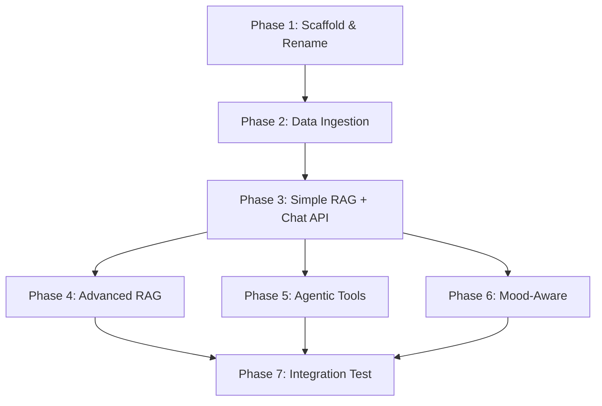

# Part 4 — Mood-Aware Layer + Part 5 — Triển khai & Rủi ro

---

## Part 4: Mood-Aware (Lớp xuyên suốt)

### Mô tả kỹ thuật
Phát hiện cảm xúc user từ message → điều chỉnh **retrieval bias** (ưu tiên loại event phù hợp mood) + **response tone** (giọng trả lời).

```
User: "Chán quá, cuối tuần không biết làm gì" → SAD
  → Retrieval bias: ưu tiên events vui nhộn, giải trí, giá rẻ
  → Tone: đồng cảm, nhẹ nhàng, gợi ý tích cực

User: "HYPE QUÁ! Concert Sơn Tùng có vé chưa???" → EXCITED
  → Retrieval bias: search chính xác theo keyword
  → Tone: nhiệt tình, nhanh, dùng emoji
```

### File: `mood/model/UserMood.java`
```java
package com.flashticket.discovery.mood.model;

/**
 * 5 trạng thái cảm xúc — ảnh hưởng retrieval bias và response tone.
 */
public enum UserMood {
    EXCITED("Nhiệt tình, nhanh, dùng emoji 🎉. Ưu tiên kết quả chính xác."),
    STRESSED("Bình tĩnh, rõ ràng, ngắn gọn. Ưu tiên sự kiện sắp diễn ra gần."),
    SAD("Đồng cảm, nhẹ nhàng, gợi ý tích cực. Ưu tiên sự kiện vui nhộn, giá rẻ."),
    RELAXED("Thoải mái, gợi ý đa dạng. Ưu tiên trải nghiệm mới lạ."),
    NEUTRAL("Chuyên nghiệp, đầy đủ thông tin. Không bias đặc biệt.");

    private final String instruction;
    UserMood(String instruction) { this.instruction = instruction; }
    public String getInstruction() { return instruction; }
}
```

### File: `mood/MoodDetector.java`
```java
package com.flashticket.discovery.mood;

import com.flashticket.discovery.mood.model.UserMood;
import dev.langchain4j.model.chat.ChatLanguageModel;
import dev.langchain4j.model.input.PromptTemplate;
import lombok.RequiredArgsConstructor;
import lombok.extern.slf4j.Slf4j;
import org.springframework.stereotype.Component;

import java.util.Map;

/**
 * Phát hiện mood từ message dùng LLM classification.
 * Lightweight: 1 LLM call nhanh với gemini-2.0-flash.
 * Fallback: NEUTRAL nếu detect fail.
 */
@Component
@RequiredArgsConstructor
@Slf4j
public class MoodDetector {

    private final ChatLanguageModel chatModel;

    private static final String DETECT_PROMPT = """
        Phân loại cảm xúc của tin nhắn sau. Trả về ĐÚNG 1 từ:
        EXCITED — Hào hứng, phấn khích, háo hức
        STRESSED — Lo lắng, gấp gáp, áp lực thời gian
        SAD — Buồn, chán, thất vọng, cô đơn
        RELAXED — Thư giãn, thoải mái, không vội
        NEUTRAL — Trung tính, hỏi thông tin bình thường

        Tin nhắn: {{message}}
        """;

    public UserMood detect(String message) {
        try {
            String result = chatModel.generate(
                PromptTemplate.from(DETECT_PROMPT)
                    .apply(Map.of("message", message))
                    .toUserMessage()
            ).content().text().trim().toUpperCase();

            return switch (result) {
                case "EXCITED" -> UserMood.EXCITED;
                case "STRESSED" -> UserMood.STRESSED;
                case "SAD" -> UserMood.SAD;
                case "RELAXED" -> UserMood.RELAXED;
                default -> UserMood.NEUTRAL;
            };
        } catch (Exception e) {
            log.warn("[MoodDetector] Failed, defaulting NEUTRAL: {}", e.getMessage());
            return UserMood.NEUTRAL;
        }
    }
}
```

### File: `mood/MoodAwarePromptEnhancer.java`
```java
package com.flashticket.discovery.mood;

import com.flashticket.discovery.mood.model.UserMood;
import org.springframework.stereotype.Component;

/**
 * Inject mood instruction vào system prompt trước khi gọi LLM.
 * Không thay đổi user message — chỉ thêm context cho LLM.
 */
@Component
public class MoodAwarePromptEnhancer {

    /**
     * Tạo mood-aware system suffix.
     * Được append vào system prompt của DiscoveryAssistant.
     */
    public String enhance(UserMood mood) {
        return String.format("""

            HƯỚNG DẪN TONE HIỆN TẠI (mood: %s):
            %s
            """, mood.name(), mood.getInstruction());
    }

    /**
     * Điều chỉnh retrieval query dựa trên mood.
     * Thêm bias keywords vào query trước khi search.
     */
    public String adjustQuery(String originalQuery, UserMood mood) {
        return switch (mood) {
            case SAD -> originalQuery + " vui nhộn giải trí giá rẻ";
            case STRESSED -> originalQuery + " gần đây sắp diễn ra";
            case EXCITED -> originalQuery; // Không bias — user đã biết muốn gì
            case RELAXED -> originalQuery + " trải nghiệm mới độc đáo";
            case NEUTRAL -> originalQuery;
        };
    }
}
```

### Tích hợp Mood vào ChatService (cập nhật)
```java
// ChatService.processMessage() — updated
public ChatResponse processMessage(String userId, String sessionId,
                                    String message, String jwtToken) {
    // 1. Detect mood
    var mood = moodDetector.detect(message);

    // 2. Enhance prompt with mood instruction
    String moodSuffix = moodEnhancer.enhance(mood);

    // 3. Set JWT context
    JwtContextHolder.set(jwtToken);
    // Set mood context cho retrieval augmentor
    MoodContextHolder.set(mood);

    try {
        // 4. AiServices tự động: RAG retrieve → tool call → generate
        String response = assistant.chat(sessionId, message);
        return new ChatResponse(sessionId, response, mood.name(), "ADAPTIVE");
    } finally {
        JwtContextHolder.clear();
        MoodContextHolder.clear();
    }
}
```

### Test Cases — Mood-Aware
```java
@Test void shouldDetectExcitedMood() {
    // "OMG concert Blackpink!!! Mua vé ngay!!" → EXCITED
}
@Test void shouldDetectSadMood() {
    // "Buồn quá, cuối tuần chẳng ai rủ đi đâu" → SAD
}
@Test void shouldAdjustQueryForSadMood() {
    String adjusted = enhancer.adjustQuery("sự kiện cuối tuần", UserMood.SAD);
    assertThat(adjusted).contains("vui nhộn giải trí giá rẻ");
}
@Test void shouldNotAdjustQueryForExcited() {
    String adjusted = enhancer.adjustQuery("concert Sơn Tùng", UserMood.EXCITED);
    assertThat(adjusted).isEqualTo("concert Sơn Tùng");
}
```

---

## Part 5: Thứ tự triển khai & Rủi ro

### 5.1 Dependency Graph



### 5.2 Thứ tự triển khai tối ưu

| Phase | Nội dung | Thời gian ước lượng | Dependencies |
|---|---|---|---|
| **1** | Scaffold: rename, pom.xml, config, SecurityConfig, schema | 1 ngày | Không |
| **2** | Data Ingestion: EmbeddingIngestionService, EventDataListener, core-service publisher | 1 ngày | Phase 1 |
| **3** | Simple RAG + Chat: EventContentRetriever, ChatService, ChatController, DiscoveryAssistant | 2 ngày | Phase 2 |
| **4** | Advanced RAG: MultiHop, CRAG, AdaptiveRouter | 2 ngày | Phase 3 |
| **5** | Agentic: BookingTool, PaymentTool, CoreServiceClient, JwtContextHolder | 2 ngày | Phase 3 |
| **6** | Mood-Aware: MoodDetector, PromptEnhancer, integration | 1 ngày | Phase 3 |
| **7** | Integration test toàn bộ, fix edge cases | 1 ngày | Phase 4+5+6 |

**Tổng ước lượng: ~10 ngày**

### 5.3 Rủi ro kỹ thuật & Cách giảm thiểu

| # | Rủi ro | Mức độ | Giảm thiểu |
|---|---|---|---|
| 1 | **LLM latency cao** (>5s/request) | 🟡 Medium | Dùng Gemini Flash (nhanh nhất), cache embedding, async streaming |
| 2 | **LLM hallucination** (trả sai thông tin event) | 🔴 High | RAG grounding, luôn trích dẫn source, thêm disclaimer |
| 3 | **JWT expired** giữa conversation dài | 🟡 Medium | Check expiry trước mỗi tool call, return "Phiên hết hạn" |
| 4 | **PGVector performance** khi data lớn | 🟢 Low | IVFFlat index, partition by status, limit active events |
| 5 | **RabbitMQ message lost** | 🟢 Low | Durable queue + DLQ + manual ACK (pattern đã proven) |
| 6 | **Breaking BookingService** | 🔴 High | KHÔNG sửa BookingService — chỉ gọi REST API qua Gateway |
| 7 | **API key leak** qua LLM | 🟡 Medium | JwtContextHolder ThreadLocal, KHÔNG pass JWT qua tool params |

### 5.4 Verification Plan

#### Automated Tests
```bash
# Unit tests
cd discovery-service
./mvnw test

# Integration test (cần Docker: Postgres + RabbitMQ + Keycloak)
./mvnw verify -Pintegration-test
```

#### Manual Verification Checklist
```
1. Service startup:
   curl http://localhost:8085/actuator/health → {"status":"UP"}

2. Eureka registration:
   curl http://localhost:8761/eureka/apps/DISCOVERY-SERVICE → registered

3. Data ingestion:
   - Tạo event mới qua core-service → check RabbitMQ queue consumed
   - curl "http://localhost:8085/api/discovery/search?q=concert" → results

4. Simple chat:
   POST /api/chat → {"sessionId":"test","message":"Có sự kiện gì cuối tuần?"}
   → Response chứa event info từ PGVector

5. Booking flow (ReAct):
   POST /api/chat → "Đặt 2 vé VIP concert ABC"
   → AI hỏi confirm
   POST /api/chat → "Đặt luôn"
   → AI gọi BookingTool → trả order number

6. Payment flow:
   POST /api/chat → "Thanh toán đi"
   → AI gọi PaymentTool → trả VNPay URL

7. Mood detection:
   POST /api/chat → "Buồn quá không biết đi đâu"
   → Response.mood = "SAD", tone đồng cảm
```

### 5.5 Câu hỏi cần xác nhận trước khi bắt đầu code

> [!IMPORTANT]
> Xin xác nhận những điểm sau trước khi tôi bắt đầu implement:

1. **Gemini API key**: Bạn đã có Gemini API key chưa? Hay dùng OpenAI trước?

2. **PGVector extension**: Database PostgreSQL hiện tại đã enable `pgvector` extension chưa? (docker-compose dùng image `pgvector/pgvector:pg14` → có sẵn, nhưng cần `CREATE EXTENSION vector;`)

3. **core-service modification**: Tôi sẽ thêm `EventSyncPublisher.java` + `EventSyncSpringEvent.java` vào `core-service/shared/event/` và thêm 1 dòng `eventPublisher.publishEvent(...)` vào `OrganizerEventService`. Bạn OK với scope sửa này?

4. **Chat memory persistence**: Lưu chat history vào PostgreSQL (discovery_schema.chat_messages) hay chỉ in-memory (mất khi restart)?

5. **Streaming response**: Có cần SSE (Server-Sent Events) để stream response từng token không? Hay batch response đủ?

---

## Tổng kết toàn bộ Plan

| Tổng files MỚI cần tạo | ~30 files |
|---|---|
| Tổng files HIỆN CÓ cần sửa | 8 files (gateway, config, core-service publisher) |
| Business logic thay đổi | **KHÔNG** — chỉ gọi API hiện có |
| Infra mới | **KHÔNG** — tận dụng PostgreSQL + RabbitMQ + PGVector |
| LangChain4j version | 1.0.0-beta5 (stable, Spring Boot 3.5 compatible) |
| Ước lượng thời gian | ~10 ngày |
